# 模型是否可以解决业务需求

# 模型部署，本质是：回归业务

## 需要考虑的问题

## 模型的保存

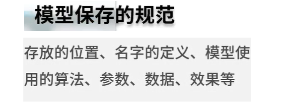

## 模型的优化

### 这个阶段的优化和模型训练阶段的优化是不同的

### 针对不同的情况使用不同的处理方法

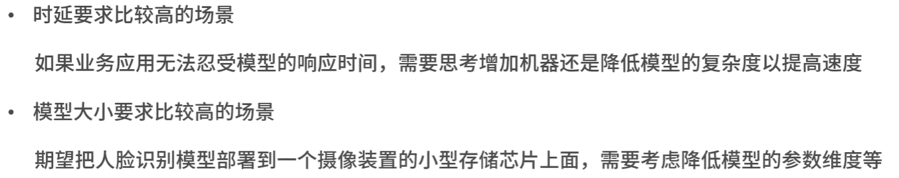

### 离线应用还是在线应用？

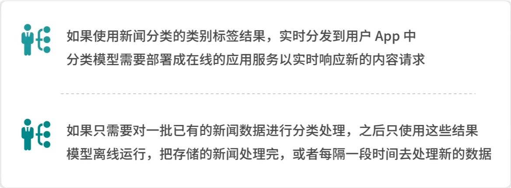

#### 在线应用场景图解

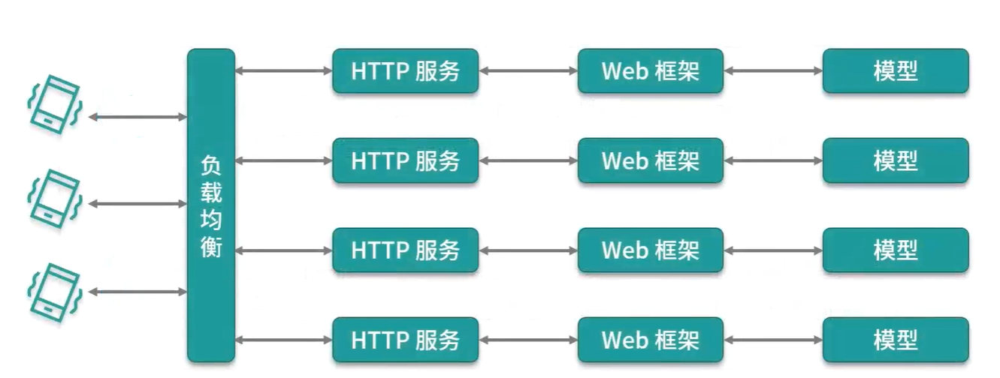

### 在线应用一个部署方案举例

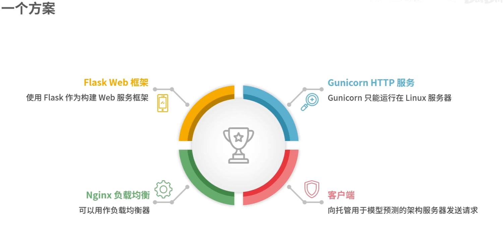

## 记录项目经历

### 总结的内容

## 多考虑一点，如何适合更多场景

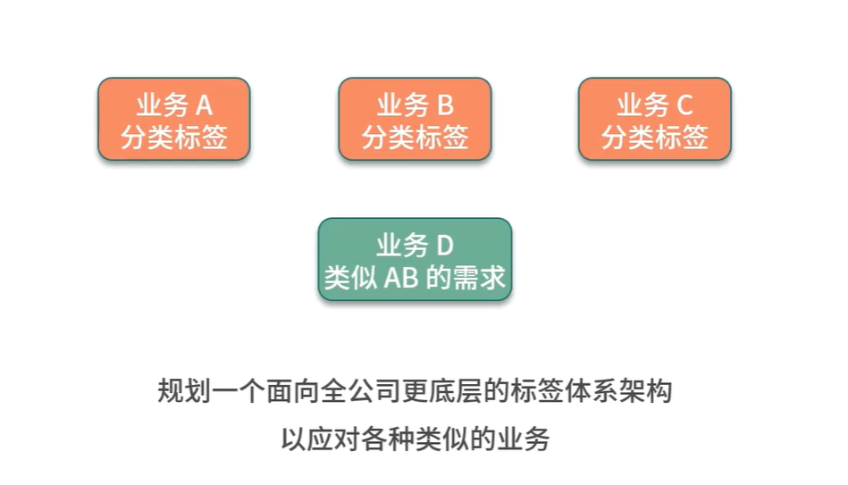

## 监控与迭代

### 模型的监控

### 结果的监控

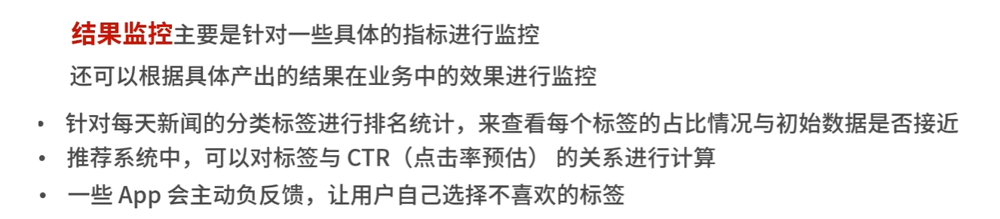

## 人工定期复审

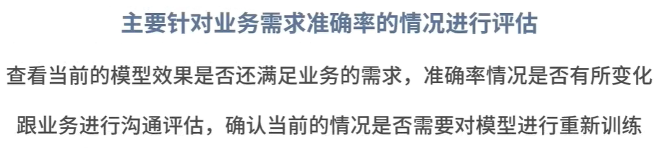

# Case收集与样本积累

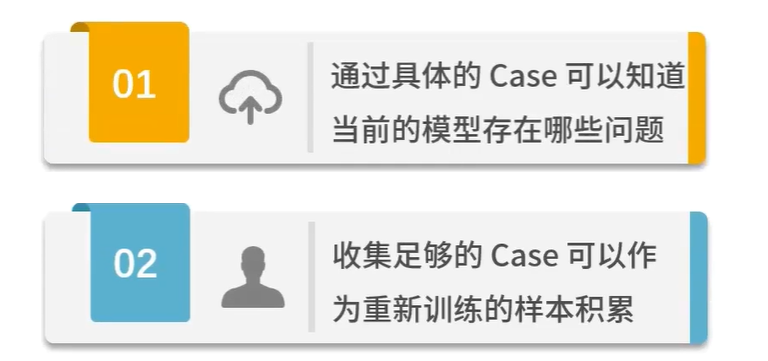

# 重新开启

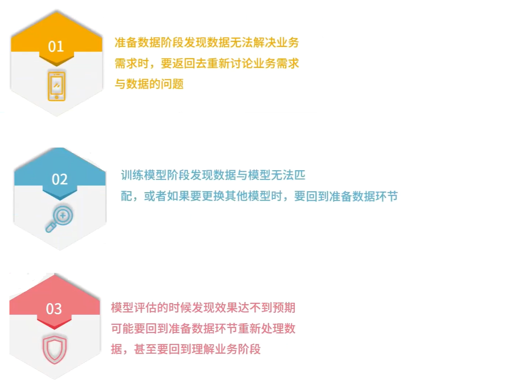

# 总结

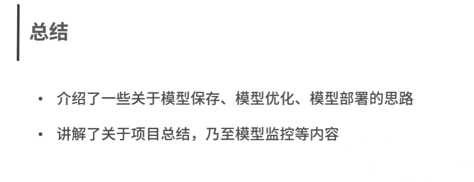

