# 1.你为什么要学习数据挖掘

## 1》各大互联公司都使用数据驱动技术

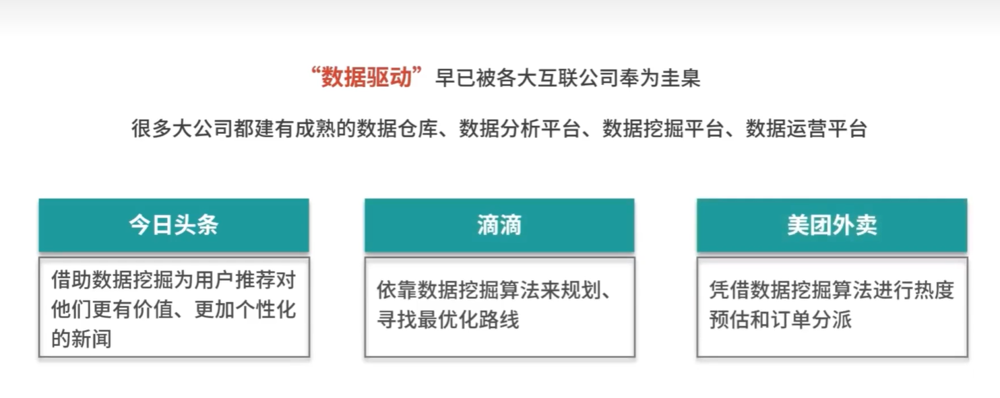

## 2.许多传统公司都在使用数据挖掘技术

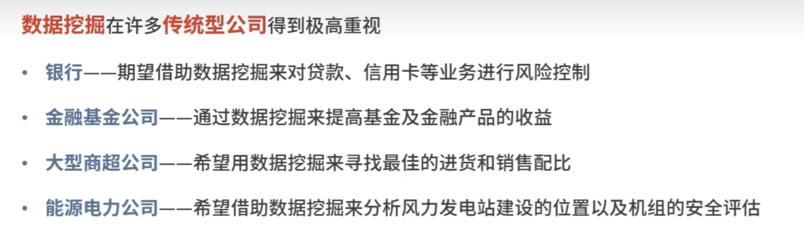

## 3.数据挖掘人才的需要仍然没有饱和

### 下面是一些岗位需求

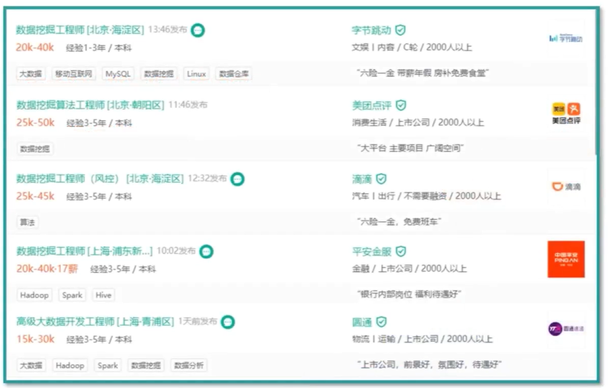

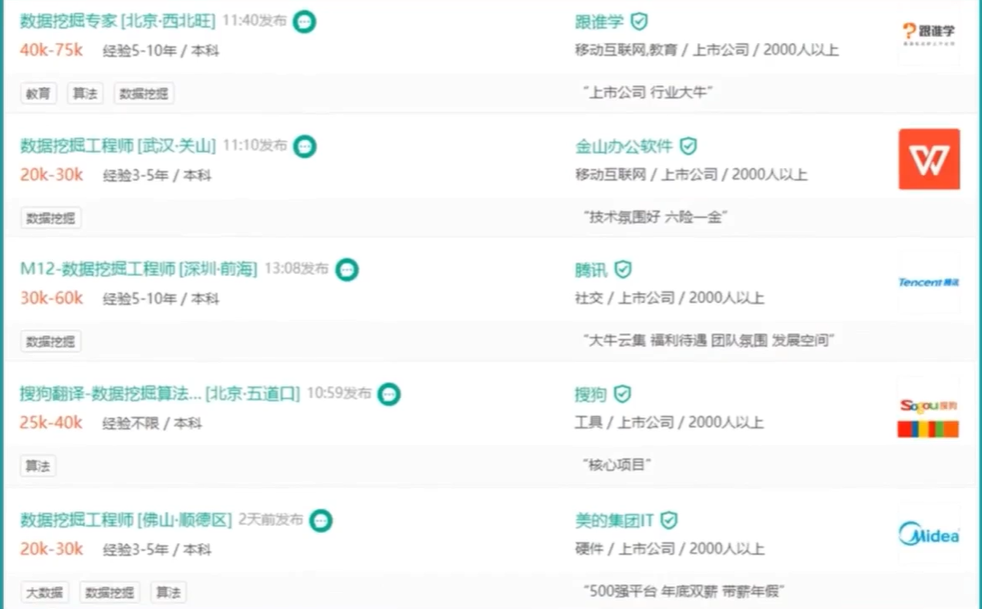

## 数据挖掘是数据分析师和业务经理的基本能力

# 2.学习的困惑

## 困惑1.学习数据挖掘并不简单，不能只学习理论

## 困惑2.没有足够实际的例子

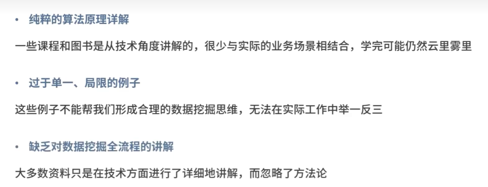

## 困惑3.缺少实际工作经验，遇到实际问题不知道从何下手

# 3.课程设计

## 模块1.基础知识

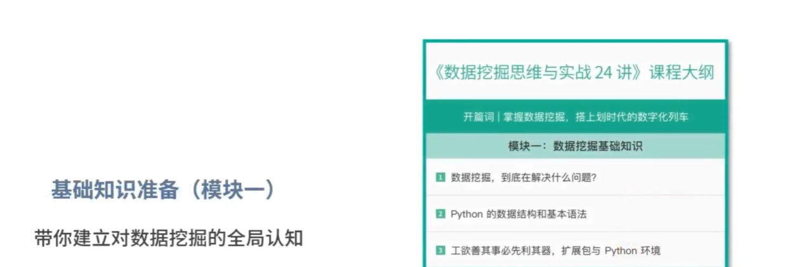

## 模块2.数据挖掘过程

## 模块3.分类问题

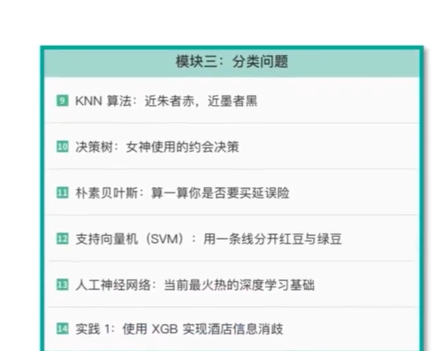

## 模块4.聚类问题

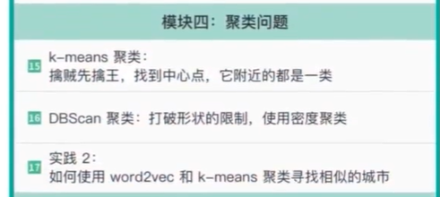

## 模块5.回归问题

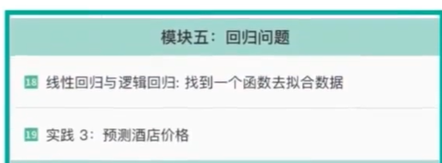

## 模块6.关联分析

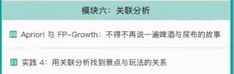

## 模块7.自然语言处理

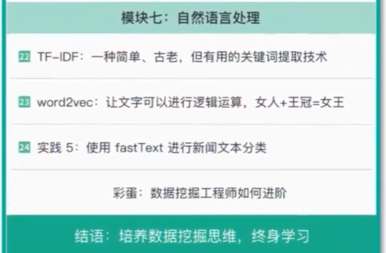

# 4.适合人群

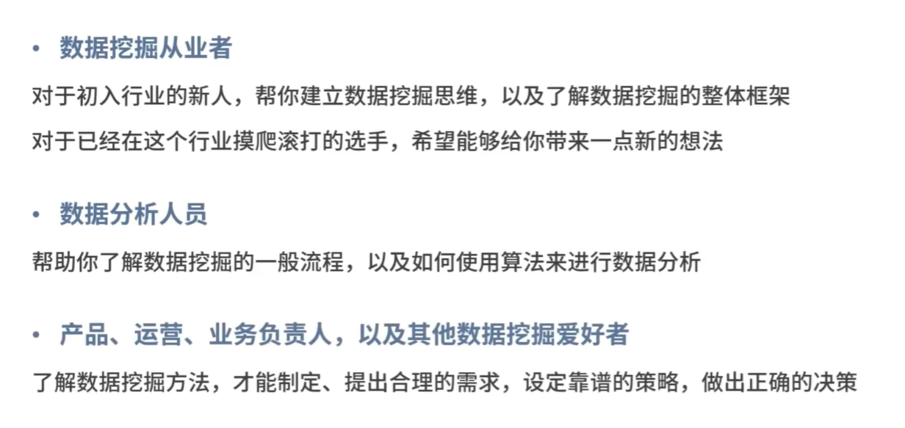