# 如何准备干净，完备的数据

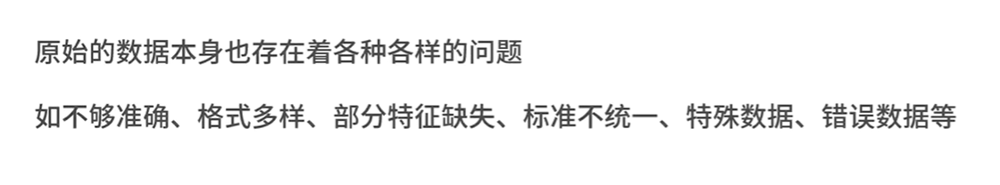

## 找到数据

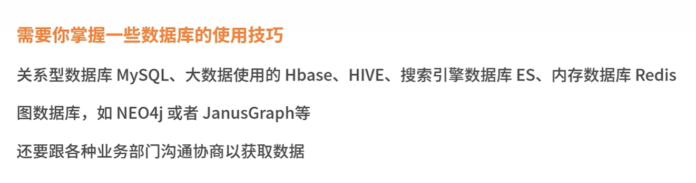

## 数据探索

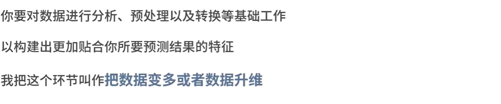

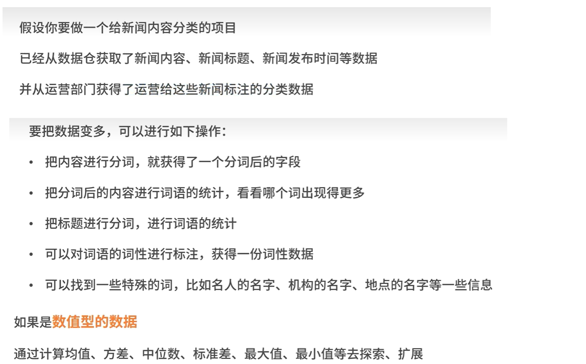

## 数据清洗（是最繁琐，最头疼的步骤），大概由5个步骤

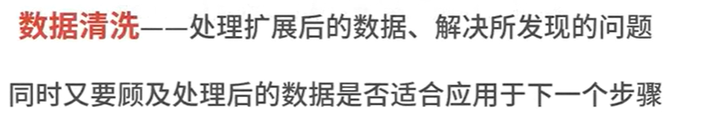

### 1》缺失值处理

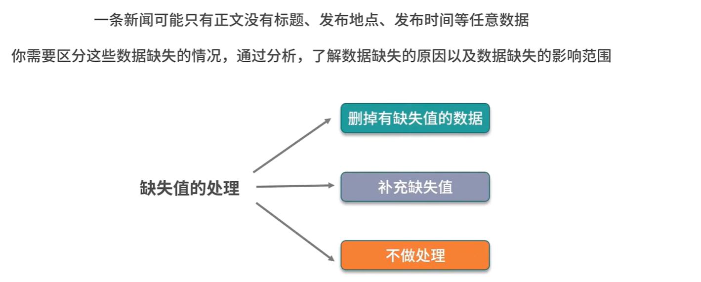

### 2》异常值处理

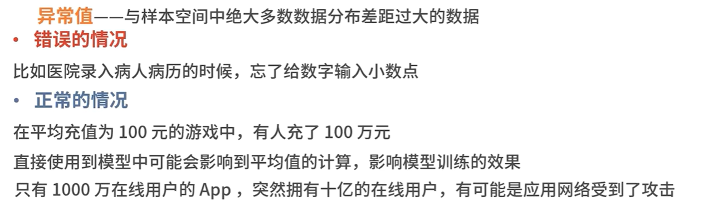

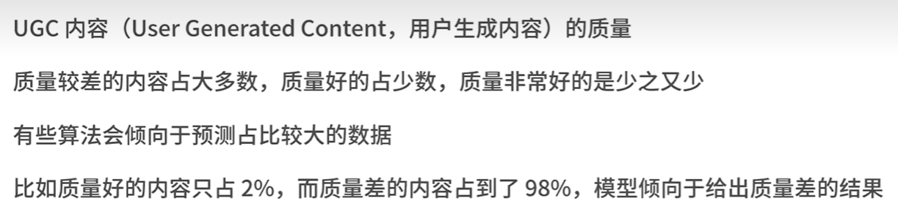

### 3》数据偏差的处理

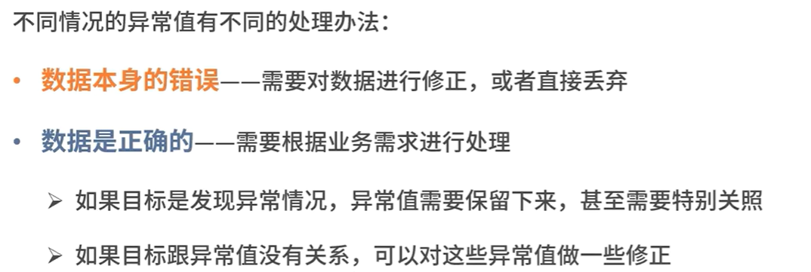

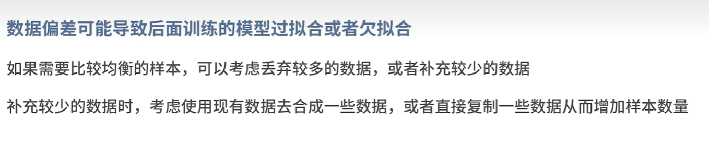

### 4》数据标准化

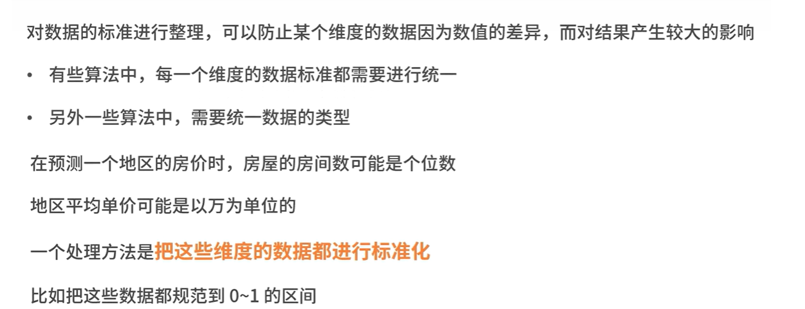

### 5》特征选择

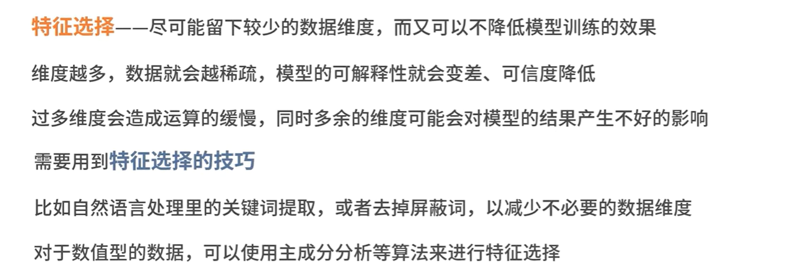

## 构建训练集于测试集

### 在训练之前，把数据集分为训练集和测试集，有时候还有验证集

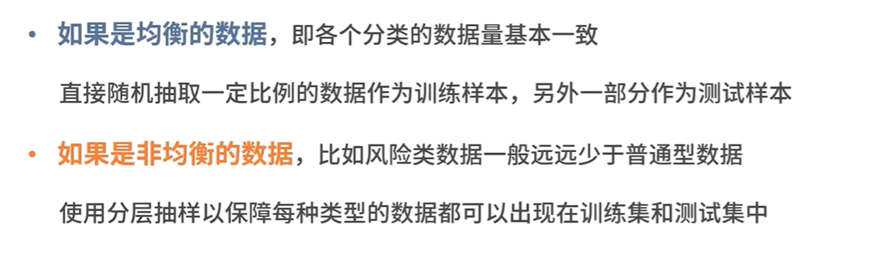

### 训练集和测试集的构建

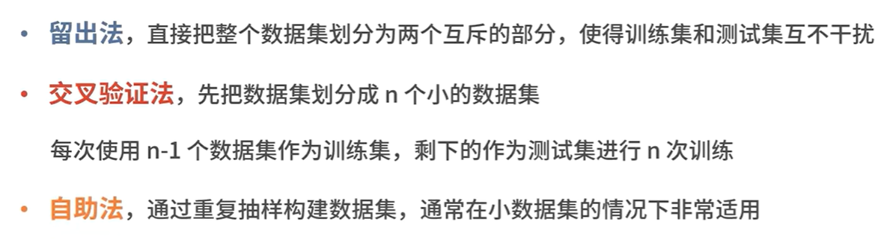

## 思想准备

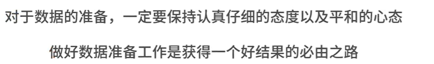

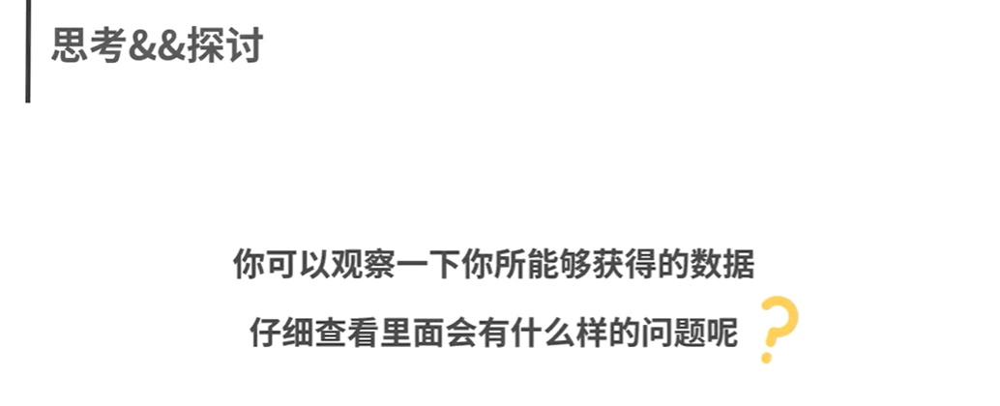
