# 模型训练

## 数据建模，如何选择一个适合我需求的算法？

## 分类问题

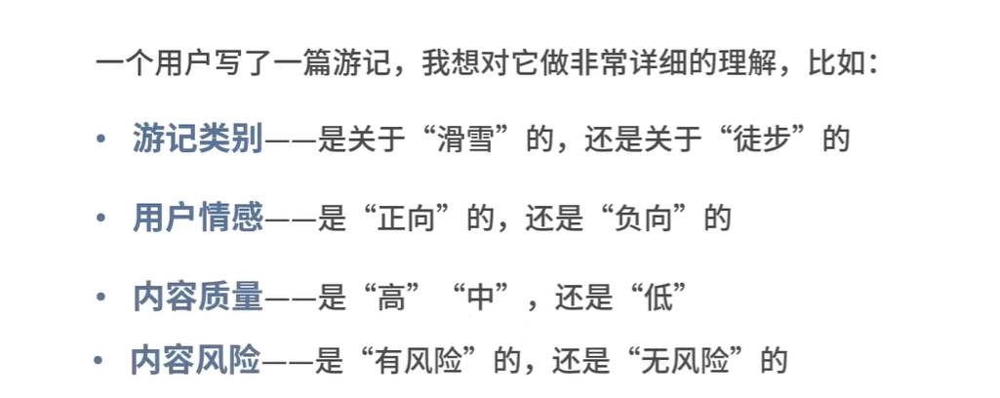

### 分类问题具体由哪些情况

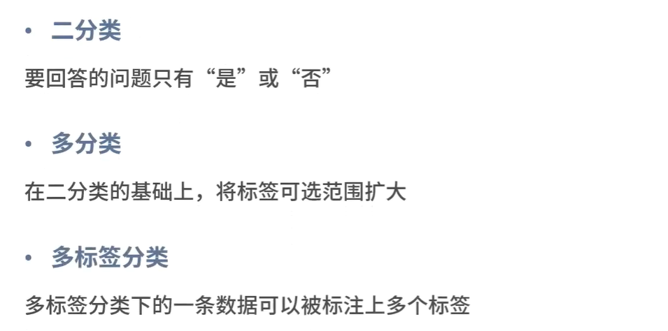

### 常见分类问题算法

## 聚类问题

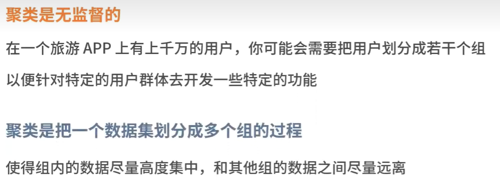

### 聚类问题的又分这几类

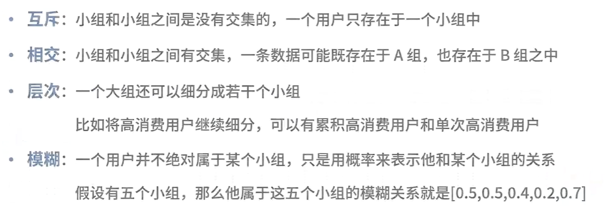

### 聚类的算法的使用场景

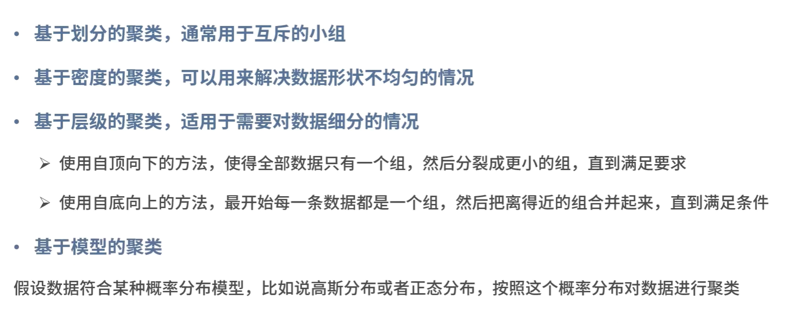

## 回归问题

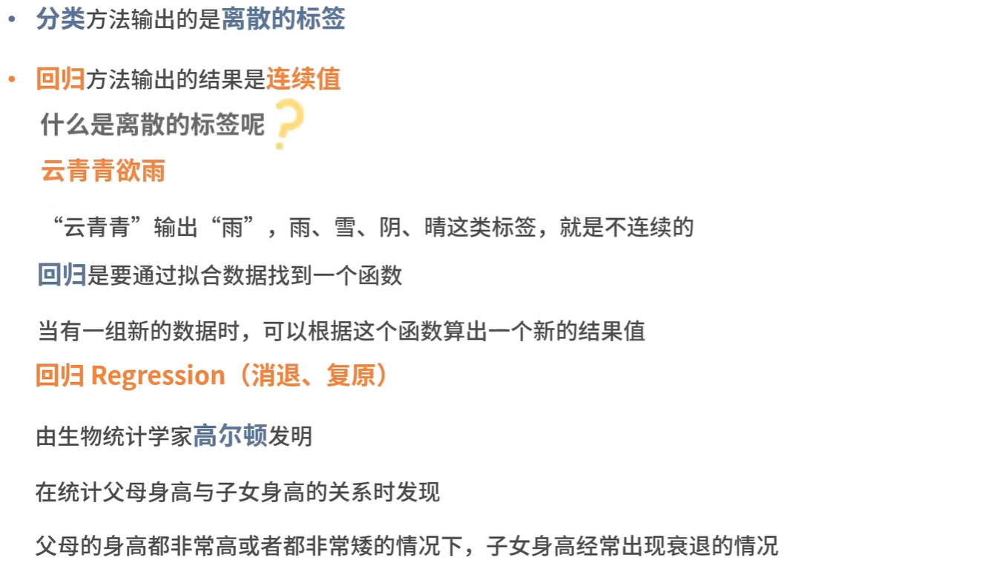

### 回归分析图

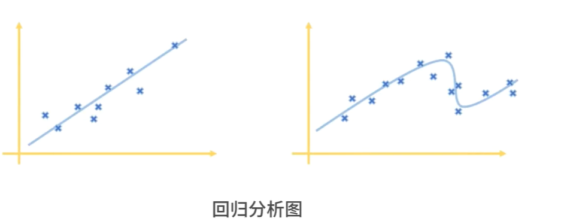

### 回归方法和分类方法是可以相互转化的

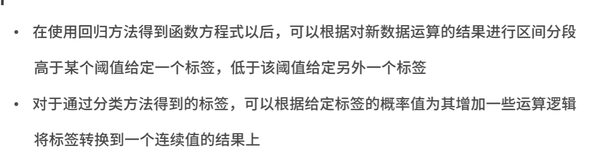

### 分类问题和回归问题的对比

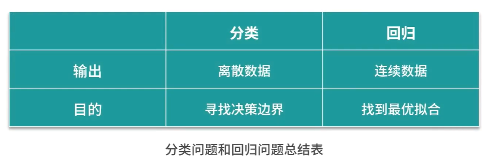

## 关联问题

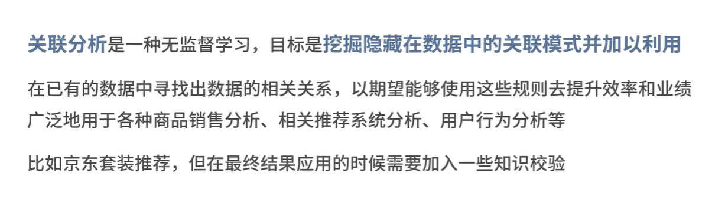

### 注意：

# 模型集成

## 常见的集成学习法

### 1.bagging（装袋法），代表算法就是：随机森林算法

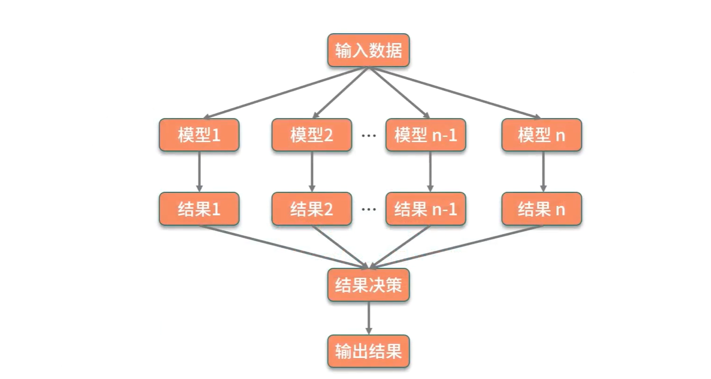

### 2.boosting（增强法）

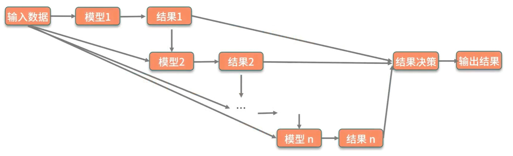

### 3.堆叠法（stacking）

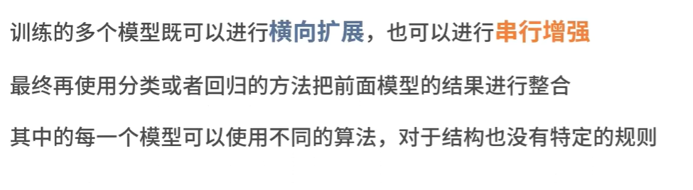

# 思考

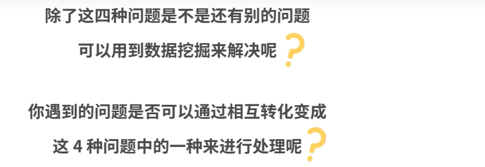
