# 模型评估

## 案例，识别图片是否是小猪的分类模型

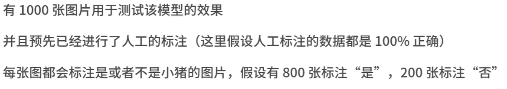

## 评估指标-混淆矩阵和准确率指标

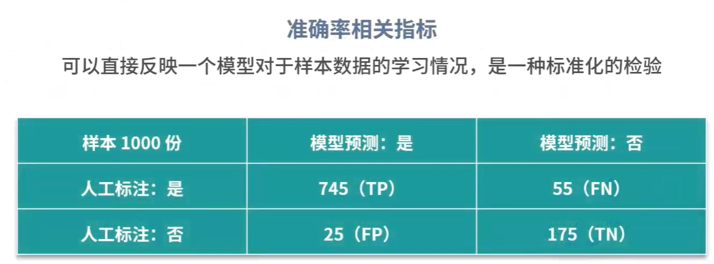

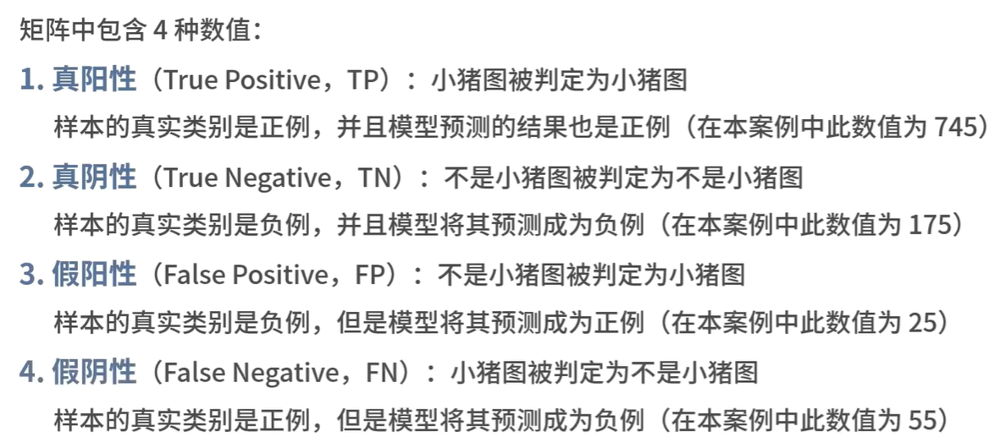

### 准确率

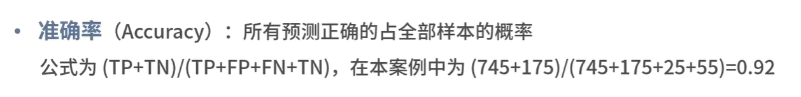

### 精确率

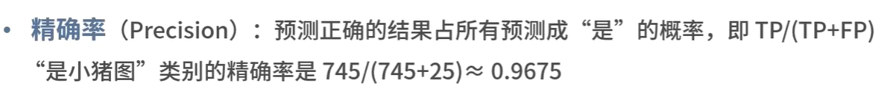

### 召回率

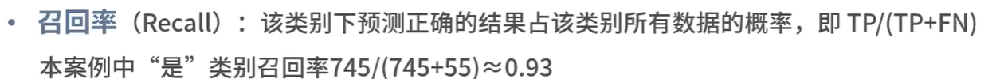

### F值（F Score)

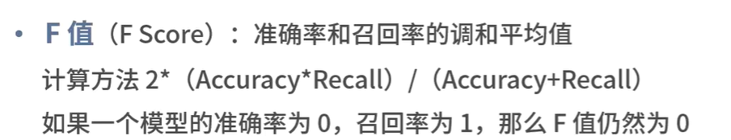

### ROC曲线哈AUC值

#### 他们是桌面来构建的呢，我们还是使用上面的小猪案例

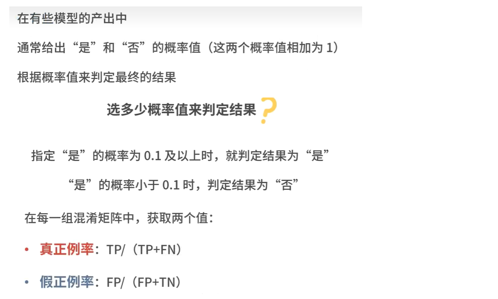

#### ROC曲线和AUC值图

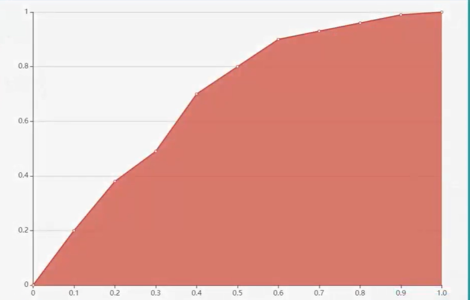

## 评估指标--十分重要的业务抽样

### 业务抽样的作用

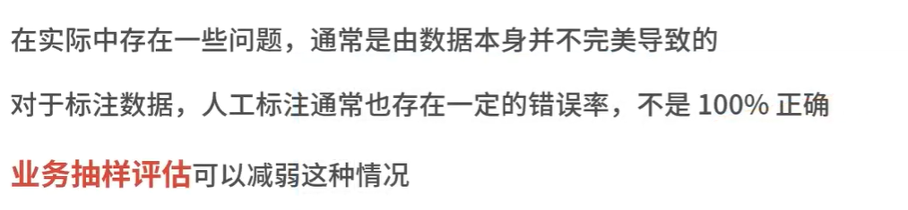

## 泛化能力评估

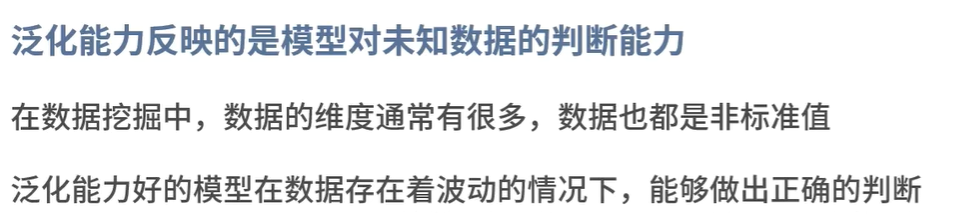

### 判断泛化能力的指标

#### 过拟合（overfitting），说明模型的泛化能力不好

#### 欠拟合（underfitting）,训练不足，泛化能力当然也不好

过拟合回到欠拟合图解

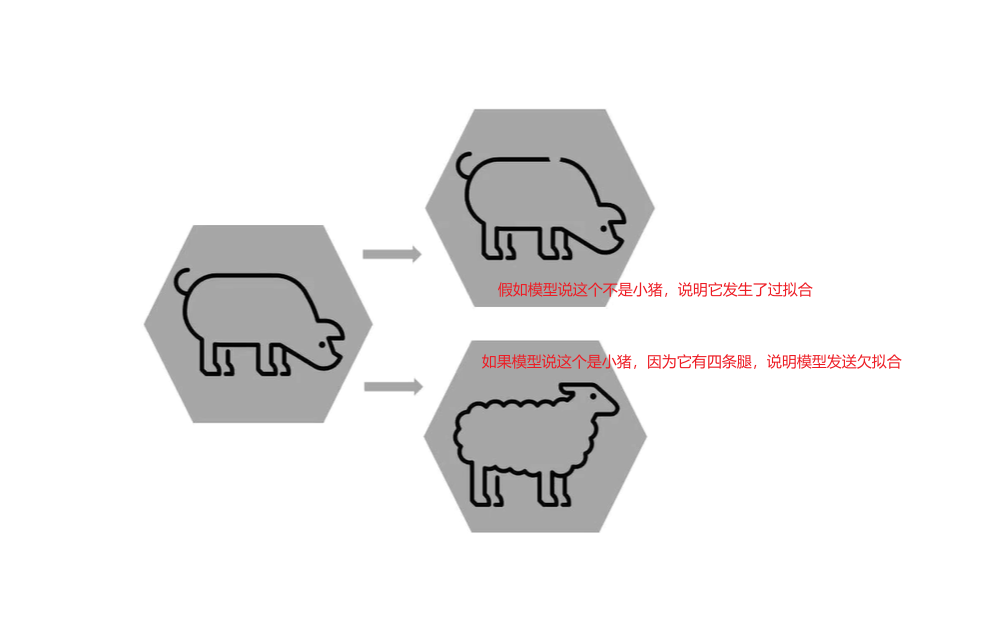

### 如何做好泛化能力评估

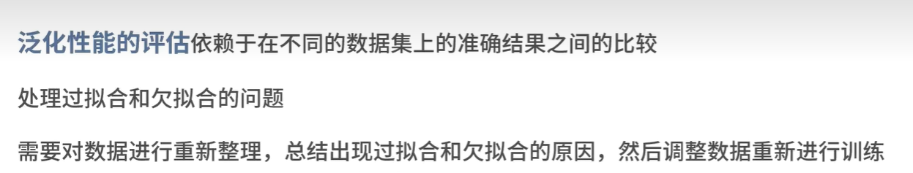

## 其它模型评估指标

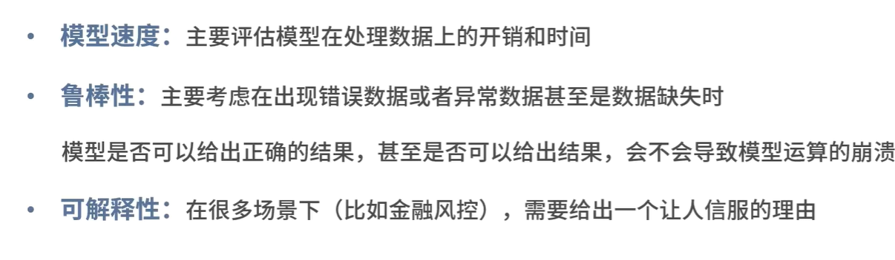

## 评估数据的处理

### 随机抽样

### 随机多次抽样

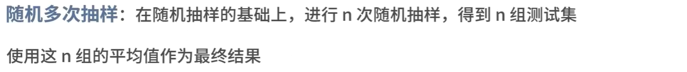

### 交叉验证

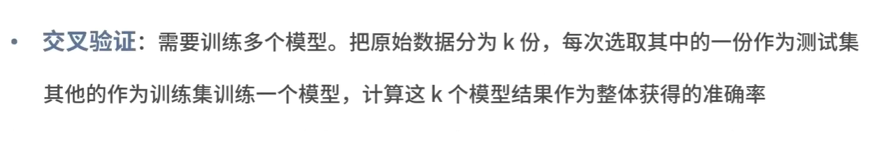

### 自助法

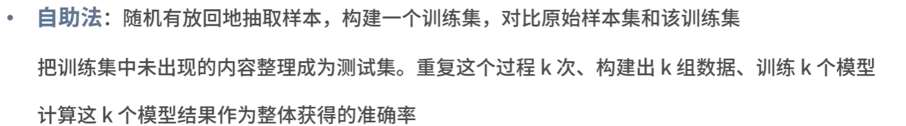

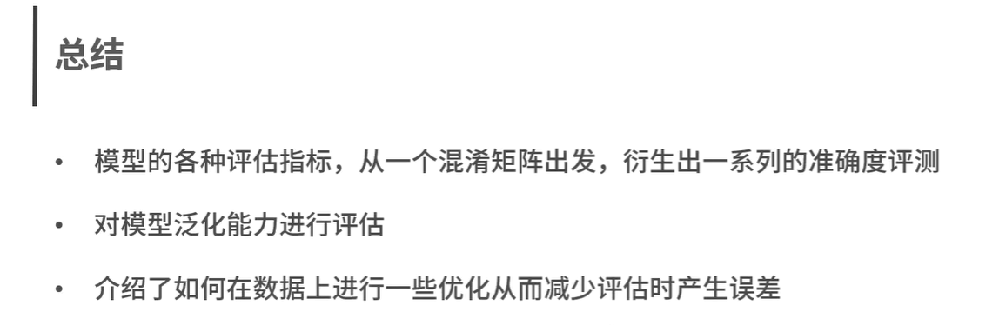

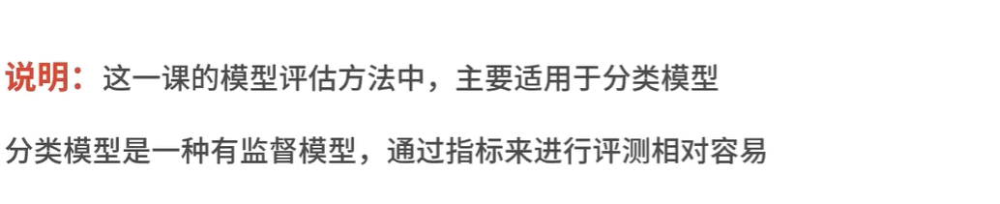

