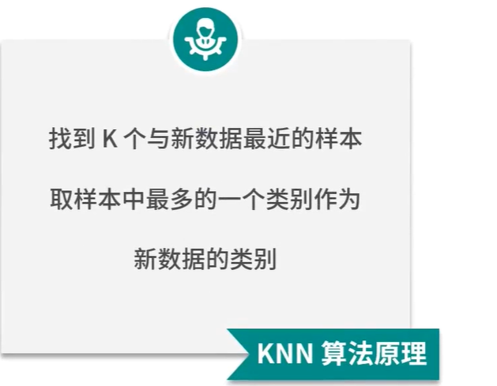
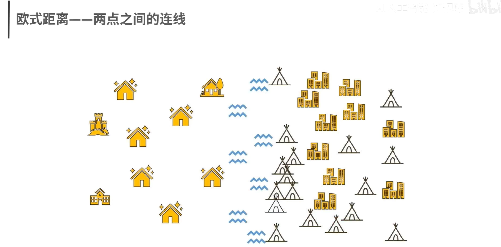
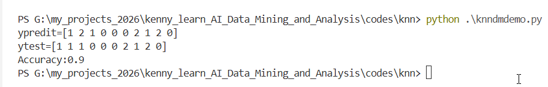
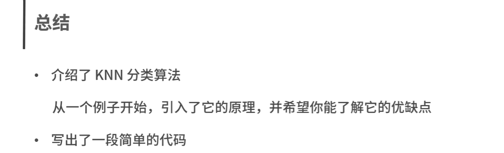

# KNN算法原理



## 距离的使用

### 欧氏距离



## 算法优点


## 算法的缺点

### 1.只适合小数据集

### 2.数据不平衡效果不好

### 3.必须要做数据标准化

### 4.不适合特征维度太多的数据

## k值的选取会影响模型的效果

### 1》k值越小，越容易发生过拟合

### 2》k值越大，越容易发生欠拟合

### 3》合适的k值需要根据经验和效果进行不断尝试

## 案例，前提是安装了scikit-learn，numpy，pandas，matplotlib，scipy

```
from sklearn import neighbors
from sklearn.datasets import load_iris
from sklearn.neighbors import KNeighborsClassifier
import numpy as np

# 设置随机种子
np.random.seed(0)

iris = load_iris()
x,y = iris.data,iris.target

# iris数据集有150条数据，我们可以用140条作为训练集，10条作为测试集
randomarr = np.random.permutation(len(x))
# train set
xtrain = x[randomarr[:-10]]
ytrain = y[randomarr[:-10]]
# test_set
xtest = x[randomarr[-10:]]
ytest = y[randomarr[-10:]]

# 创建分类器对象
knn = KNeighborsClassifier()
# 模型训练
knn.fit(xtrain,ytrain)
# 模型预测
ypred = knn.predict(xtest)

probilty = knn.predict_proba(xtest)
# 计算最后一个测试样本距离最近的5个点
neighborpoints = knn.kneighbors([xtest[-1]],5)
# 计算score
score = knn.score(xtest,ytest,sample_weight=None)
print(f"ypredit={ypred}")
print(f"ytest={ytest}")
print(f"Accuracy:{score}")


```


### 运行结果：



# 总结

