# 决策树：女神使用的约会决策

## 1.从一个例子出发，看看女神是怎样决定要不要和某人约会

### 女神约会决策图

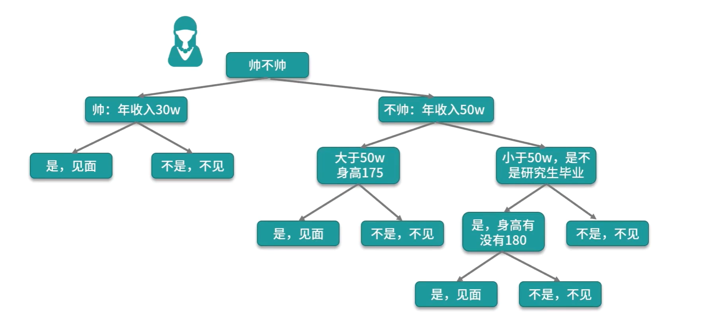

### 决策树执行流程


### 假如女神收到3个人的约会邀请，他们的条件如下表

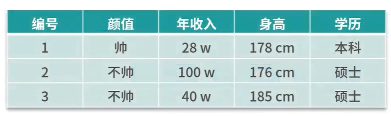

### 我们来看看决策的结果

#### 第一个人的结果是：不见

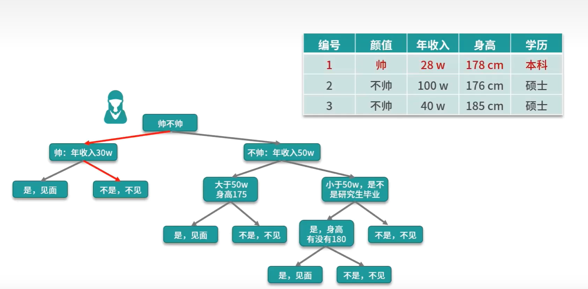

#### 第二个人的结果是：见

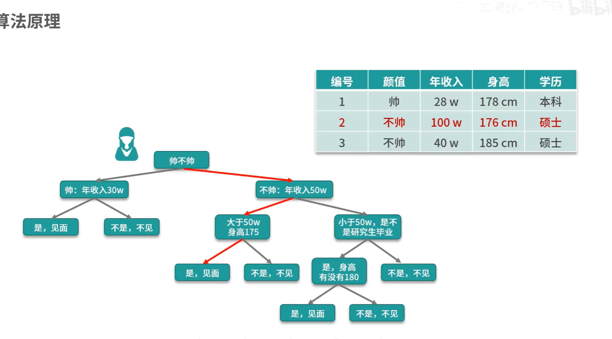

#### 第三个人的结果是：见

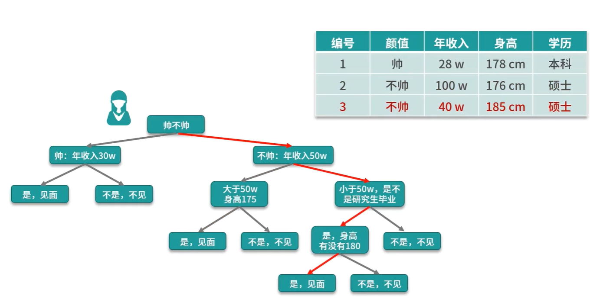


### 问题：如何选择合适的根节点？下一次又该选择哪个特征作为节点？

#### 使用信息增益法

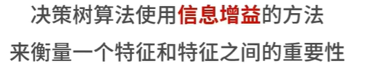


## 2.分析算法原理，思路形成的过程

### 理想情况

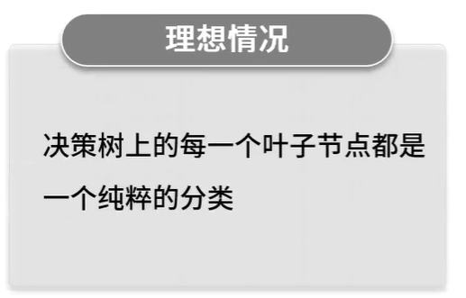

### 实际情况.

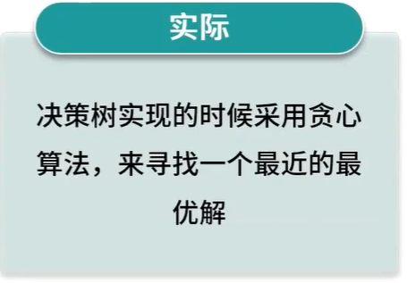

### 几个版本的决策树的比较

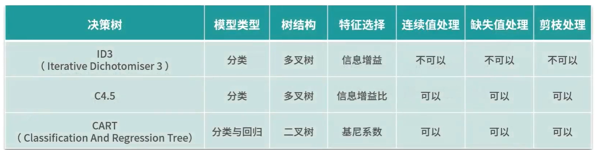

#### 我们主要使用最后一种

### 决策树的优点


### 决策树的缺点

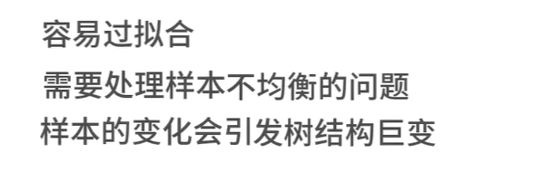

### 关于剪枝，有预剪枝和后剪枝，预剪枝的效果不好。


## 小案例，还是iris案例

```
from sklearn import neighbors
from sklearn.datasets import load_iris
from sklearn.tree import DecisionTreeClassifier
import numpy as np

# 设置随机种子
np.random.seed(0)

iris = load_iris()
x,y = iris.data,iris.target

# iris数据集有150条数据，我们可以用140条作为训练集，10条作为测试集
randomarr = np.random.permutation(len(x))
# train set
xtrain = x[randomarr[:-10]]
ytrain = y[randomarr[:-10]]
# test_set
xtest = x[randomarr[-10:]]
ytest = y[randomarr[-10:]]

# 创建分类器对象
tree = DecisionTreeClassifier(max_depth=4)
# 模型训练
tree.fit(xtrain,ytrain)
# 模型预测
ypred = tree.predict(xtest)

probilty = tree.predict_proba(xtest)

# 计算score
score = tree.score(xtest,ytest,sample_weight=None)
print(f"ypredit={ypred}")
print(f"ytest={ytest}")
print(f"Accuracy:{score}")


```


### 为了方便绘图，我们使用jupyter lab来开发，先安装一个pydotplus

```
pip install pydotplus
```

### 然后添加绘图功能代码

```
from IPython.display import Image
from sklearn import tree
# dot是一个程序化生成流程图的简单语言
import pydotplus

dot_data = tree.export_graphviz(dt,out_file=None,feature_names=iris.feature_names,
                                class_names=iris.target_names,filled=True,rounded=True,
                                special_characters=True)

graph = pydotplus.graph_from_dot_data(dot_data)
Image(graph.create_png())
```


### 运行程序就会得到一个图，具体可以运行dtreedemo.ipynb查看结果，和下面的图形类似

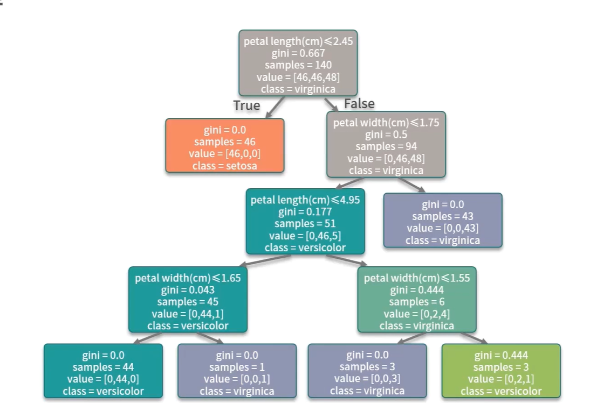


## 3.扩展：由此衍生的高级版本

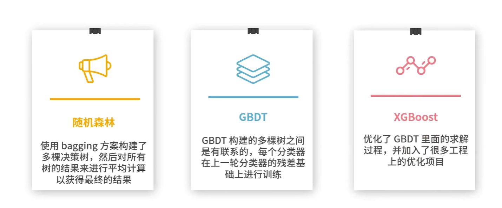

# 思考，你对否对决策树的实现细节中还有什么疑惑？

