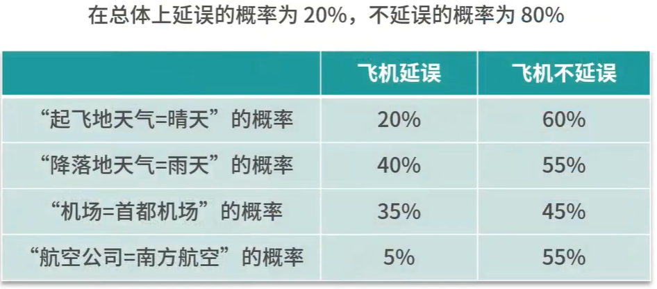
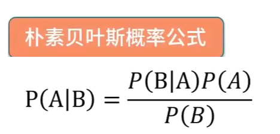
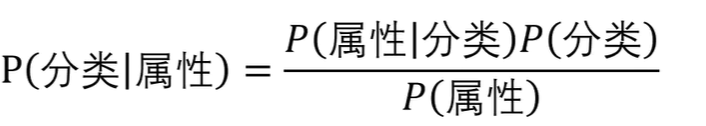
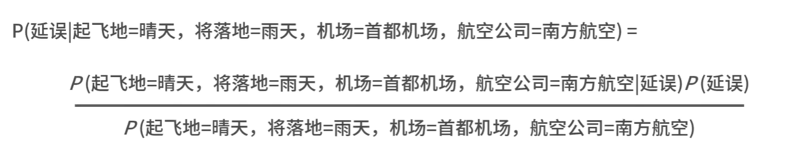
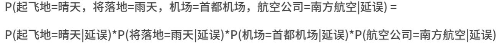
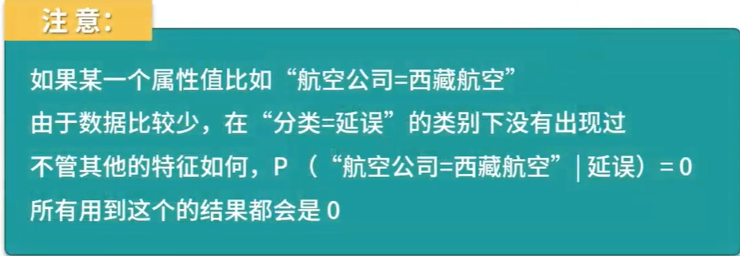
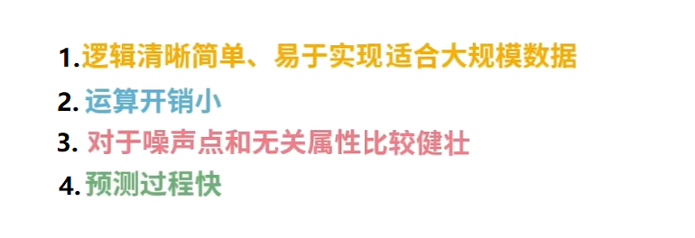
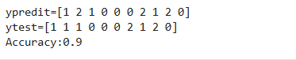

# 朴素贝叶斯算法

## 以案例切入


### 把数据整理成表格




#### 此时不延误的概率大于延误的概览，不需要买保险

## 朴素贝叶斯算法的原理以及优缺点

### 算法原理

### 上面这个案例就是贝叶斯概率公式的应用




### 转化为通俗的方式



### 把上面的案例的数据导入公式，就会得到下面的表达式



### 也可以推导出




### 如何处理连续值？


### 关于平滑



### 朴素贝叶斯算法的优点




### 朴素贝叶斯算法的缺点


## 项目演练，使用jupyter lab来学习

## 1.在kenny_learn_AI_Data_Mining_and_Analysis\codes文件夹里面新建一个naivebayes文件夹，在里面新建一个nbeiyes.ipynb文件，内容如下

```
from sklearn import neighbors
from sklearn.datasets import load_iris
from sklearn.naive_bayes import GaussianNB

import numpy as np

# 设置随机种子
np.random.seed(0)

iris = load_iris()
x,y = iris.data,iris.target

# iris数据集有150条数据，我们可以用140条作为训练集，10条作为测试集
randomarr = np.random.permutation(len(x))
# train set
xtrain = x[randomarr[:-10]]
ytrain = y[randomarr[:-10]]
# test_set
xtest = x[randomarr[-10:]]
ytest = y[randomarr[-10:]]

# 创建分类器对象
clf = GaussianNB()
# 模型训练
clf.fit(xtrain,ytrain)
# 模型预测
ypred = clf.predict(xtest)

# 计算score
score = clf.score(xtest,ytest,sample_weight=None)
print(f"ypredit={ypred}")
print(f"ytest={ytest}")
print(f"Accuracy:{score}")
```


### 运行效果：



## 朴素贝叶斯算法的扩展


### 半朴素贝叶斯算法参考文档1： https://zhuanlan.zhihu.com/p/350772160

### 半朴素贝叶斯算法参考文档2：https://www.cnblogs.com/wang_yb/p/18859897

### 半朴素贝叶斯算法参考文档3：https://zhuanlan.zhihu.com/p/518617685

### AODE算法参考文档1：https://developer.cloud.tencent.com/article/2647352

### AODE算法参考文档2：https://zhuanlan.zhihu.com/p/377045404

### AODE算法参考文档3：https://www.geeksforgeeks.org/machine-learning/averaged-one-dependence-estimators-aode/
