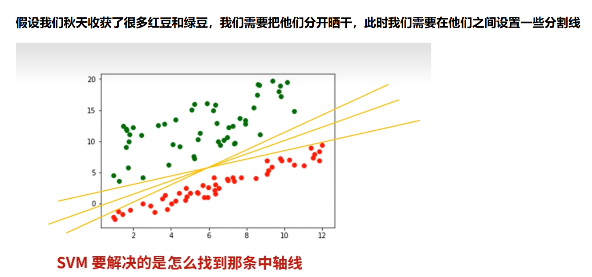
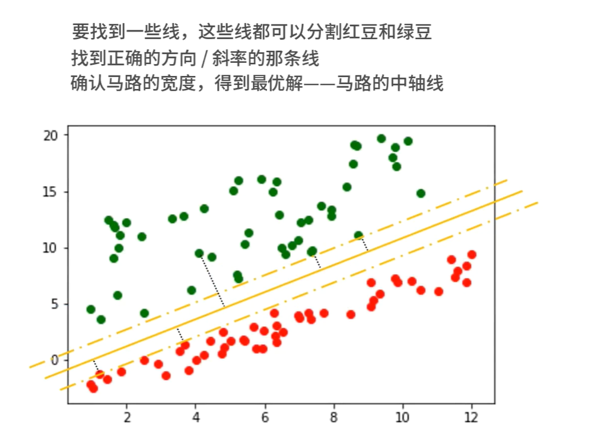
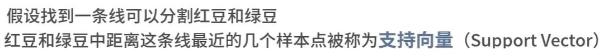
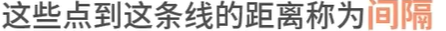
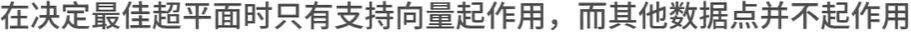
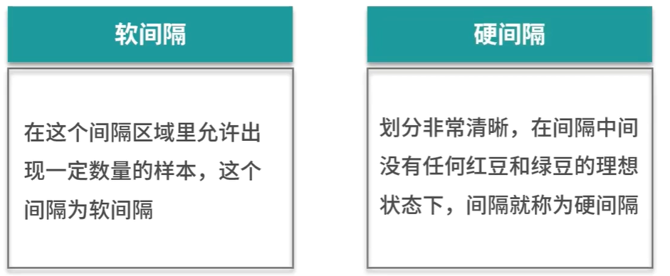
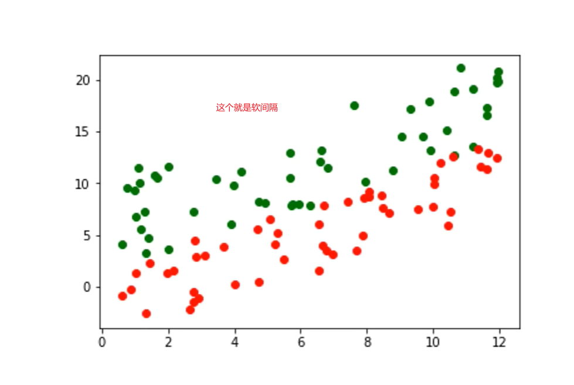
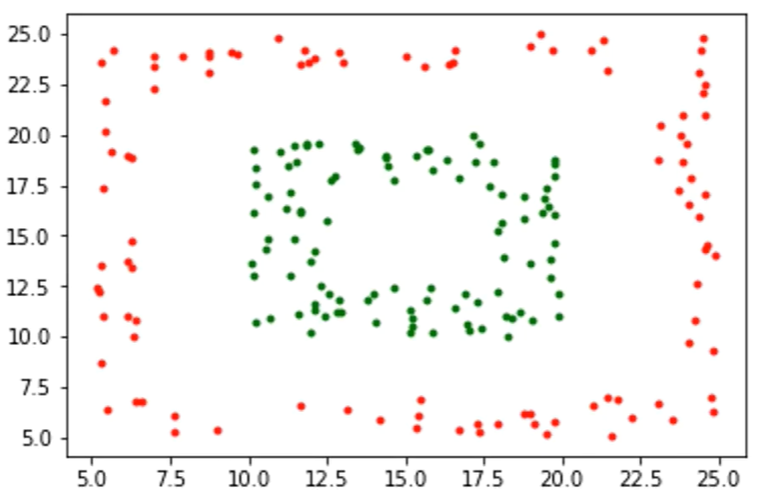
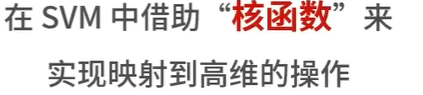
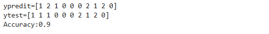

# 支持向量机SVM

## 通过一个案例切入：区分红豆和绿豆案例



## SVM算法原理



## SVM的一些相关概念

### 超平面


### 支持向量







## SVM如何处理不清晰的边界？有软间隔和硬间隔2种处理方法





## 如何处理非线性可分




### SVM的处理方法是：




### 常见的核函数有3种


## SVM算法的优缺点

### SVM算法的优点


### SVM算法的缺点


# 演练，使用jupyter lab,新建一个svm文件夹里面有一个svmsample.ipynb,内容如下

```
from sklearn import neighbors
from sklearn.datasets import load_iris
from sklearn import svm

import numpy as np

# 设置随机种子
np.random.seed(0)

iris = load_iris()
x,y = iris.data,iris.target

# iris数据集有150条数据，我们可以用140条作为训练集，10条作为测试集
randomarr = np.random.permutation(len(x))
# train set
xtrain = x[randomarr[:-10]]
ytrain = y[randomarr[:-10]]
# test_set
xtest = x[randomarr[-10:]]
ytest = y[randomarr[-10:]]

# 创建分类器对象
clf = svm.SVC(kernel='linear')
# 模型训练
clf.fit(xtrain,ytrain)
# 模型预测
ypred = clf.predict(xtest)

# 计算score
score = clf.score(xtest,ytest,sample_weight=None)
print(f"ypredit={ypred}")
print(f"ytest={ytest}")
print(f"Accuracy:{score}")
```


### 运行效果




### 问题，SVM是用来处理2分类的问题，为什么这里是3分类也能够使用？


