# 人工神经网络

## 神经网络的背景


## 人工神经网络的基础算法

### 先来看一个案例


### 人的大脑的工作原理

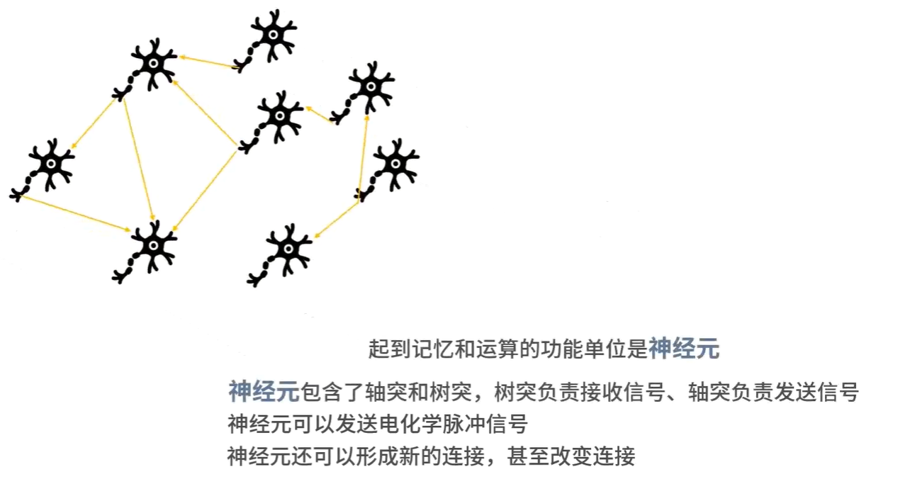

## 神经网络的算法原理

### 先来看一个最简单的神经系统


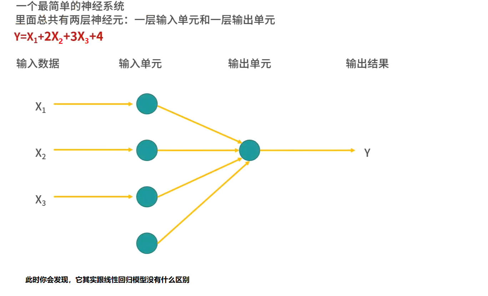

### 然后我们在输入和输出层之间添加一个隐藏层，此时效果就不一样了

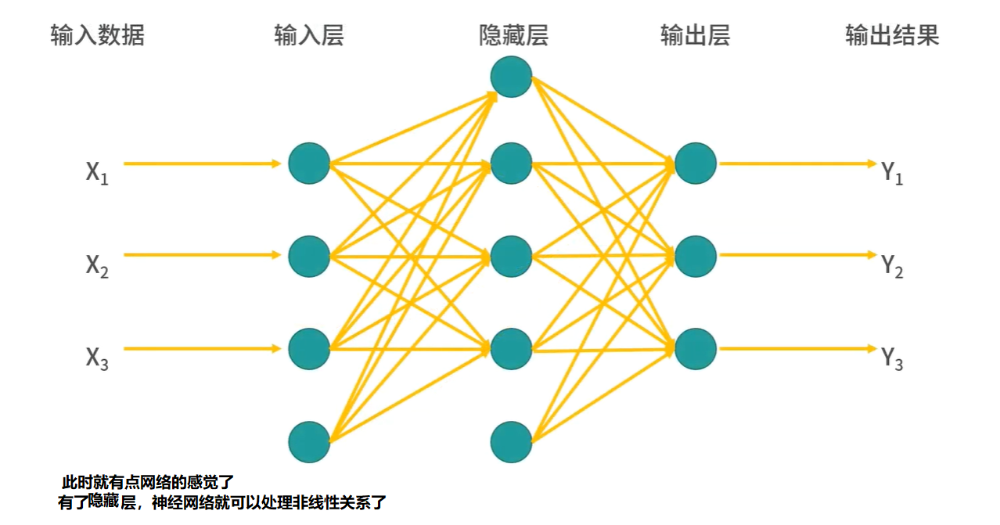

### 原理，流程大概有四步

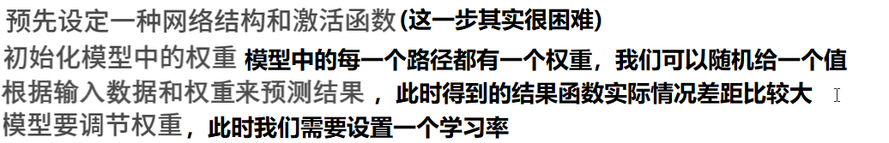

### 关于激活函数

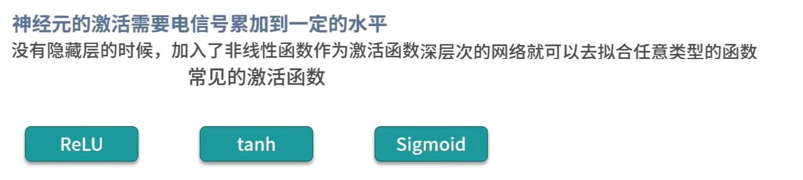

## 神经网络算法的优缺点

### 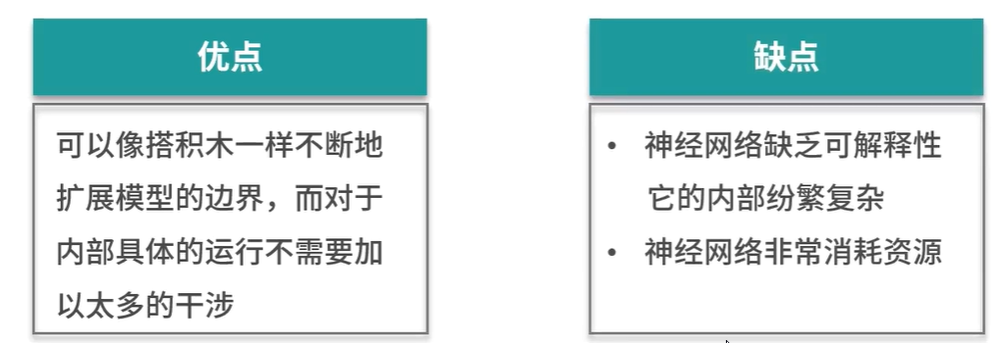

### 神经网络在信用评级和风险控制等方面不能使用


## 演练，使用jupyter lab，新建一个neuralnetwork文件夹，在里面新建一个neuralnetworkdm.ipynb文件，代码如下

```
from sklearn import neighbors
from sklearn.datasets import load_iris
from sklearn.neural_network import MLPClassifier

import numpy as np

# 设置随机种子
np.random.seed(0)

iris = load_iris()
x,y = iris.data,iris.target

# iris数据集有150条数据，我们可以用140条作为训练集，10条作为测试集
randomarr = np.random.permutation(len(x))
# train set
xtrain = x[randomarr[:-10]]
ytrain = y[randomarr[:-10]]
# test_set
xtest = x[randomarr[-10:]]
ytest = y[randomarr[-10:]]

clf = MLPClassifier(
    solver='lbfgs',alpha=1e-5,hidden_layer_sizes=(5,2),random_state=1
)
# 模型训练
clf.fit(xtrain,ytrain)
# 模型预测
ypred = clf.predict(xtest)
# 评分
score = clf.score(xtest,ytest,sample_weight=None)
print(f"ypredit={ypred}")
print(f"ytest={ytest}")
print(f"Accuracy:{score}")
print(f"layers nums:{clf.n_layers_}")

```


### 运行程序，发现效果非常差

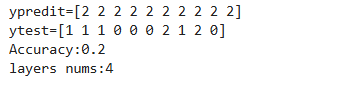

## 我们修改一下hidden_layer_size参数

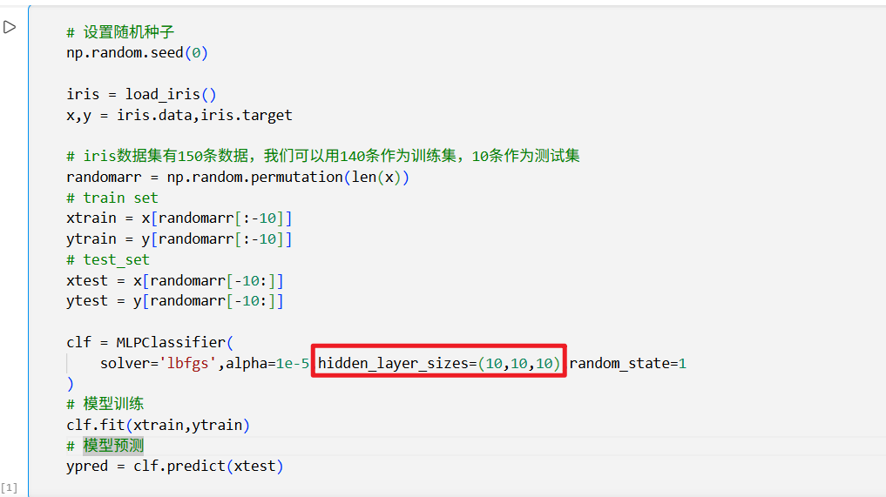


### 重新运行程序，效果就上来了

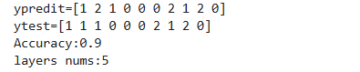

# 扩展内容：大力出奇迹

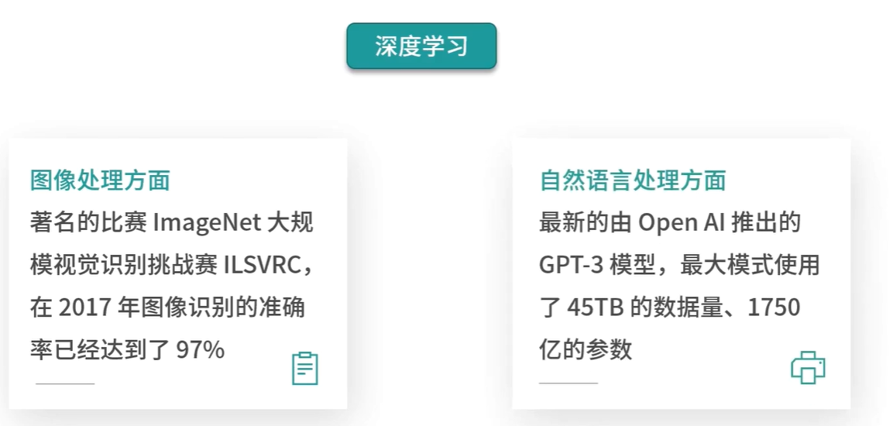

# 总结

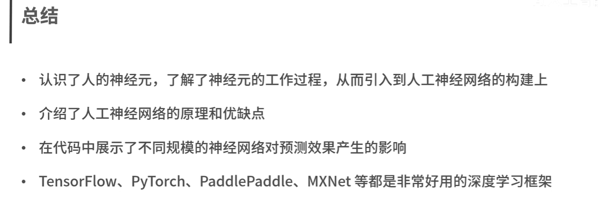