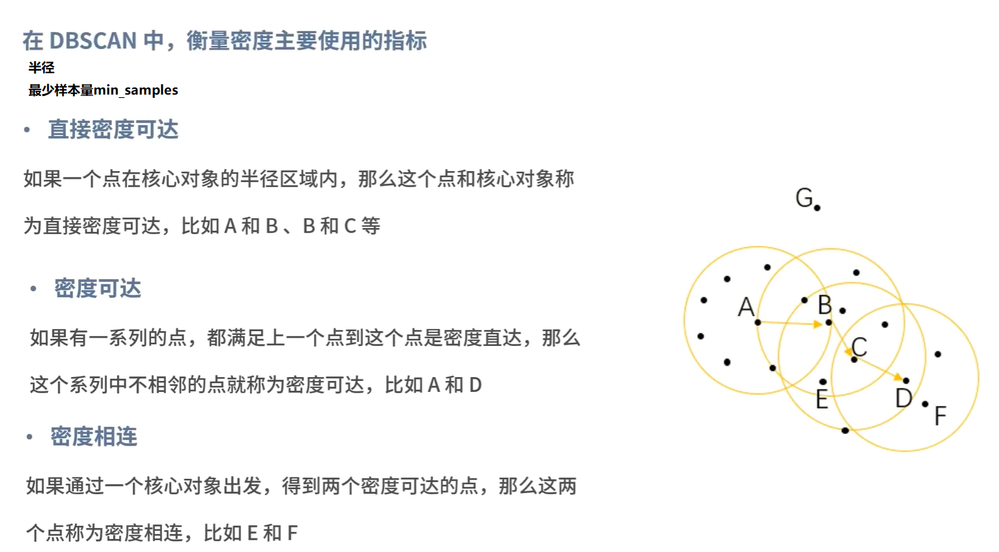
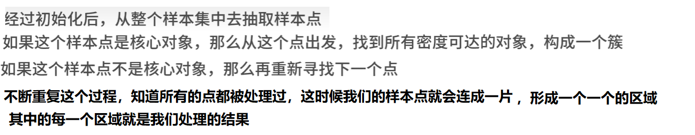
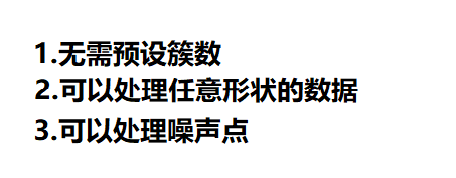
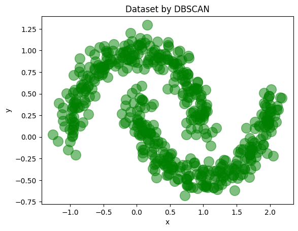
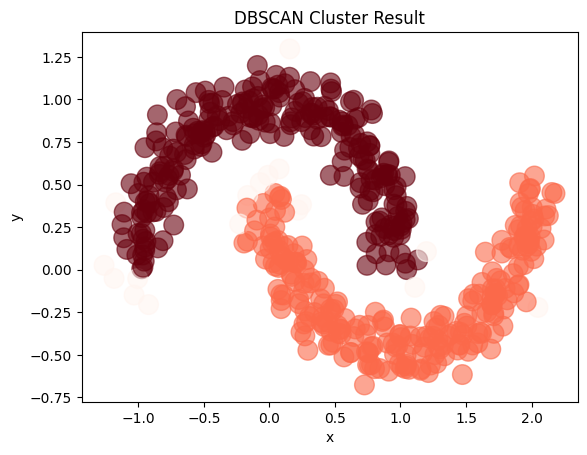

# DBSCan的引入背景，以国庆节用红花和绿草来摆国庆图案

## 案例


## DBSCan算法原理




## 处理步骤



## 算法优缺点

### 优点



### 缺点


## 课堂案例：

```python
from sklearn import datasets
import pandas as pd
import matplotlib.pyplot as plt
from sklearn.cluster import dbscan # 注意，这里是小写的，不是类

# 生成500个点，噪声0.1
X,_ = datasets.make_moons(500,noise=0.1,random_state=1)
df = pd.DataFrame(X,columns=['x','y'])
df.plot.scatter('x','y',s=200,alpha=0.5,c='green',title='Dataset by DBSCAN')
plt.show()
```


​    


```python
import numpy as np
core_samples,cluster_ids = dbscan(X,eps=0.2,min_samples=20)
df = pd.DataFrame(np.c_[X,cluster_ids],columns=['x','y','cluster_id'])
df['cluster_id'] = df['cluster_id'].astype('i2')
df.plot.scatter('x','y',s=200,c=list(df['cluster_id']),cmap='Reds',colorbar=False,alpha=0.6,title='DBSCAN Cluster Result')
plt.show()
```



    


# 参考文档

## 一、密度聚类概述


**密度聚类**是一种基于数据密度分布的聚类方法，其核心思想是通过评估样本的紧密程度来划分类别。与传统的划分聚类（如 `K-Means`）和层次聚类不同，密度聚类无需预先指定聚类的数量，且能够有效识别任意形状的聚类，包括**非凸数据**，同时还能识别噪声点。这使得密度聚类在处理复杂数据分布时具有独特的优势。

传统的划分聚类算法（如 `K-Means`）通常假设簇是凸的（球状），并且簇之间分离良好。然而，在现实世界的数据中，簇的形状往往是不规则的（如环状、螺旋状），且可能包含噪声。密度聚类通过寻找被低密度区域分离的高密度区域，能够克服这些限制。只要高密度区域是连通的，它们就能被归为一个簇，而不管形状多么怪异。

------

## 二、DBSCAN 算法原理


`DBSCAN` (Density-Based Spatial Clustering of Applications with Noise) 算法是一种基于密度的聚类方法，它通过分析数据集中每个数据点的密度分布，将具有足够高密度的区域划分为簇，并将低密度区域视为噪声。

### 2.1 关键定义


为了理解 DBSCAN，我们需要先明确以下几个核心概念。

#### 2.1.1 ε-邻域 (Epsilon-Neighborhood)


对于数据点 xj，其 ε-邻域（记作 Nε(xj)）是指数据集中所有与 xj 的距离不超过 ε 的样本点的集合。数学上，可以表示为：

Nε(xj)=xi∈D∣distance(xi,xj)≤ε

其中，$D$ 是数据集，$\text{distance}(x_i, x_j)$ 是衡量两个点之间距离的函数，通常采用欧氏距离。

#### 2.1.2 核心对象 (Core Point)


如果数据点 xj 的 ε-邻域内至少包含 `MinPts` 个样本点（包括自身），则 xj 被称为核心点。即：

如果 |Nε(xj)|≥MinPts, 则 xj 是核心点

核心点是高密度区域的中心，它们周围有足够的邻居点。

#### 2.1.3 密度直达 (Directly Density-Reachable)


如果数据点 xi 位于核心点 xj 的 ε-邻域内，则称 xi 由 xj 密度直达。

> **注意**：密度直达关系通常不是对称的。只有当 xi 也是核心点时，关系才对称；如果 xi 是边界点，则它不能“直达”核心点。

#### 2.1.4 密度可达 (Density-Reachable)


如果存在一条由密度直达关系构成的路径，即存在一个样本序列 p1,p2,…,pt，使得 p1=xj，$p_t = x_k$，并且对于每个 k=1,2,…,t−1，$p_{k+1}$ 由 pk 密度直达，则称 xk 由 xj 密度可达。

密度可达关系具有传递性。

#### 2.1.5 密度相连 (Density-Connected)


如果存在至少一个核心点 xm，使得 xi 和 xj 都由 xm 密度可达，则称 xi 和 xj 密度相连。

密度相连关系是对称的，即如果 xi 和 xj 密度相连，则 xj 和 xi 也密度相连。这是定义同一个簇的基础。

### 2.2 聚类过程


DBSCAN 的聚类过程可以概括为以下步骤：

1. **初始化**：标记所有对象为未访问（unvisited）。

2. **遍历**：随机选择一个未访问的数据点 P。

3. 邻域检查

   ：

   - 如果 P 的 ε-邻域内样本数 ≥ `MinPts`，则标记 P 为**核心点**，并创建一个新的簇 C。
   - 如果 P 的 ε-邻域内样本数 < `MinPts`，则标记 P 为**噪声点**（注意：噪声点在后续过程中可能会被归入某个簇成为边界点）。

4. 簇扩展

   ：

   - 对于核心点 P，将其邻域内所有点加入簇 C。
   - 对于邻域内每个点 P′，如果 P′ 也是未访问的，则标记为已访问；如果 P′ 也是核心点，则将其邻域内的点也加入簇 C。
   - 重复此过程，直到簇 C 无法再扩展（即找不到密度可达的点）。

5. **重复**：重复步骤 2-4，直到所有点都被访问过。

### 2.3 优势与局限性分析


`DBSCAN` 算法在处理具有复杂形状和不同密度分布的数据集时表现出色，但也存在一定的局限性。

| **特性**   | **核心点**       | **详细说明**                                               |
| ---------- | ---------------- | ---------------------------------------------------------- |
| **优势**   | **无需预设簇数** | 不需要像 K-Means 那样指定 K 值。                           |
|            | **处理任意形状** | 能发现月牙形、环形等非凸簇。                               |
|            | **鲁棒性强**     | 能够有效识别并剔除噪声点（离群点）。                       |
| **局限性** | **参数敏感**     | ε 和 `MinPts` 的选择对结果影响较大。                       |
|            | **密度不均问题** | 当不同簇的密度差异很大时，很难选择一组通用的参数。         |
|            | **高维数据挑战** | 在高维空间中，距离度量失效（维数灾难），导致聚类效果下降。 |

------

## 三、DBSCAN 算法的 Python 实现


理论的掌握离不开实践的验证。在本章中，我们将通过两个部分来深入理解 DBSCAN：

1. **手动实现**：不依赖第三方库，从零实现核心逻辑，深入理解邻域搜索和簇扩展机制。
2. **进阶实战**：使用 scikit-learn 处理一个更有意义的“虚拟城市人口分布”案例，展示 DBSCAN 在复杂场景下的强大能力。

### 3.1 手动实现 DBSCAN


为了演示算法细节，我们首先使用一组简单的月牙形数据。

#### 3.1.1 数据准备


```
from sklearn import datasets
import matplotlib.pyplot as plt
import numpy as np

# 生成月牙形数据
noisy_moons, _ = datasets.make_moons(n_samples=100, noise=0.05, random_state=10)
```


#### 3.1.2 算法核心逻辑


接下来，我们手写实现 `DBSCAN` 算法的核心逻辑。为了代码的清晰性和可维护性，我们将距离计算和邻域搜索封装为辅助函数。

```
def euclidean_distance(a, b):
    """
    计算两个点之间的欧氏距离
    :param a: 点 A 的坐标 (array-like)
    :param b: 点 B 的坐标 (array-like)
    :return: 欧氏距离 (float)
    """
    return np.sqrt(np.sum((np.array(a) - np.array(b)) ** 2))

def search_neighbors(data, point_idx, eps):
    """
    查找指定点的 epsilon-邻域内的所有点索引
    :param data: 数据集
    :param point_idx: 当前点的索引
    :param eps: 邻域半径
    :return: 邻居点的索引集合 (set)
    """
    neighbors = set()
    for i in range(len(data)):
        # 计算当前点与数据集中所有点的距离
        if euclidean_distance(data[point_idx], data[i]) <= eps:
            neighbors.add(i)
    return neighbors

def dbscan_cluster(data, eps, min_samples):
    """
    DBSCAN 聚类算法主函数
    :param data: 数据集 (numpy array)
    :param eps: 邻域半径 (epsilon)
    :param min_samples: 成为核心点所需的最小邻域样本数 (MinPts)
    :return: 聚类标签列表 (list)，0 表示未分类/噪声(初始)，正整数表示簇 ID
    """
    n_samples = len(data)
    labels = [0] * n_samples  # 初始化标签：0 表示未访问
    cluster_id = 0            # 当前簇 ID

    # 标记噪声点通常用 -1，这里为了简化，初始 0 既代表未访问也暂存
    # 在本实现中：0=未访问, -1=噪声, >0=簇ID

    for point_idx in range(n_samples):
        # 如果该点已被访问（归类于某个簇或标记为噪声），则跳过
        if labels[point_idx] != 0:
            continue

        # 1. 查找当前点的邻居
        neighbors = search_neighbors(data, point_idx, eps)

        # 2. 判断是否为核心点
        if len(neighbors) < min_samples:
            labels[point_idx] = -1  # 标记为噪声
        else:
            # 3. 创建新簇，并扩展簇
            cluster_id += 1
            labels[point_idx] = cluster_id

            # 将邻居放入栈中进行扩展（深度优先搜索 DFS 思想，也可以用队列 BFS）
            neighbors_stack = list(neighbors)

            while neighbors_stack:
                neighbor_idx = neighbors_stack.pop()

                # 处理未访问的点或之前被标记为噪声的点
                if labels[neighbor_idx] == -1:
                    # 之前被标为噪声，现在被核心点“捞”回来，归入当前簇
                    labels[neighbor_idx] = cluster_id
                elif labels[neighbor_idx] == 0:
                    # 未访问过的点，归入当前簇
                    labels[neighbor_idx] = cluster_id

                    # 检查这个邻居点是否也是核心点
                    new_neighbors = search_neighbors(data, neighbor_idx, eps)
                    if len(new_neighbors) >= min_samples:
                        # 如果是核心点，将其邻居也加入待处理栈，继续扩展
                        neighbors_stack.extend(new_neighbors)

    return labels
```


#### 3.1.3 聚类结果可视化


使用我们实现的 `DBSCAN` 算法对月牙形数据进行聚类，并将结果可视化。

```
# 执行 DBSCAN 聚类
# eps=0.3: 邻域半径
# min_samples=5: 最小样本数
dbscan_labels = dbscan_cluster(noisy_moons, eps=0.3, min_samples=5)

# 可视化结果
plt.figure(figsize=(8, 5))
plt.scatter(noisy_moons[:, 0], noisy_moons[:, 1], c=dbscan_labels, cmap="plasma")
plt.title("DBSCAN Clustering Results")
plt.xlabel("Feature 1")
plt.ylabel("Feature 2")
plt.colorbar(label="Cluster ID")
plt.show()
```


从聚类结果可以看出，`DBSCAN` 算法成功地将月牙形数据正确聚类为两类（不同颜色代表不同簇），且如果有孤立点，它们会被标记为噪声（通常颜色最深或单独一种颜色）。

### 3.2 进阶实战：虚拟城市人口分布分析


虽然手写实现有助于理解原理，但在实际工程中，我们通常使用 `scikit-learn` 等成熟库来处理更复杂的数据。为了展示 DBSCAN 在真实场景中的威力，我们设计了一个“虚拟城市人口分布”案例。

在这个案例中，我们模拟了一个包含以下特征的复杂城市结构：

1. **高密度中心城区**：呈现团状分布的密集居住区。
2. **沿河/沿路居住带**：沿着河流或公路分布的非凸长条形区域。
3. **稀疏郊区/噪声**：散落在周边的零星住户。

通过对比 **DBSCAN** 和 **K-Means** 在该数据集上的表现，我们将直观地看到 DBSCAN 如何：

- 自动发现任意形状的簇（如弯曲的河流带）。
- 自动识别并剔除噪声。
- 无需预先指定簇的数量。

我们已经准备了完整的 Jupyter Notebook，包含了数据生成、参数选择（k-距离图）、聚类分析及可视化的全过程。

> 完整实战案例与代码：[DBSCAN Clustering Case Study](https://github.com/ForceInjection/hands-on-ML/blob/main/nju_software/ch-05/03_DBSCAN.ipynb)

------

## 四、HDBSCAN 算法简介


`HDBSCAN` (Hierarchical Density-Based Spatial Clustering of Applications with Noise) 是在 `DBSCAN` 基础上发展而来的一种改进密度聚类算法。它结合了层次聚类的思想，旨在解决 `DBSCAN` 对参数 ε 和 `MinPts` 敏感的问题，特别是当数据集中簇的密度不均匀时。

DBSCAN 的主要痛点在于，对于密度差异较大的数据集，很难找到一个全局最优的 ε 参数。如果 ε 选得太大，高密度簇可能会合并；如果 ε 选得太小，低密度簇可能会被误判为噪声。

`HDBSCAN` 通过以下机制解决了这个问题：它不再依赖单一的距离阈值，而是通过构建一个簇的层次结构（Cluster Hierarchy），并使用“稳定性”指标来从层次结构中提取最优的平坦簇（Flat Clusters）。

`HDBSCAN` 的主要步骤包括：

1. **变换空间**：根据密度调整距离（Mutual Reachability Distance），使低密度区域的点距离变得更远，从而增强聚类的鲁棒性。
2. **构建最小生成树**：基于调整后的距离构建最小生成树（MST），这相当于构建了一个连通图。
3. **构建层次结构**：通过逐步去除 MST 中权重最大的边，将图分裂成更小的连通分量，从而构建出簇的层次树（Dendrogram）。
4. **压缩簇树**：根据最小簇大小（minimum cluster size）压缩层次树，去除那些稍纵即逝的小簇，简化层次结构。
5. **提取簇**：从压缩树中提取最稳定的簇。这里的“稳定性”是指簇在不同 ε 值下保持存在的持久度。持久度越高的簇越可能是真实的结构。

通过这种方式，HDBSCAN 能够自动适应数据的密度变化，通常只需要用户指定一个直观的参数 `min_cluster_size`，大大降低了调参难度。

------

## 五、总结


本文系统地介绍了 **DBSCAN** 密度聚类算法，从理论基础到代码实现，再到实际案例分析，全面解析了这一经典算法。

回顾全文，DBSCAN 的核心价值在于打破了传统划分聚类（如 K-Means）对簇形状的假设。通过引入“核心点”、“边界点”和“噪声点”的概念，它能够：

1. **发现任意形状的簇**：无论是球状、环状还是不规则的长条状，只要密度连通，就能被正确识别。
2. **鲁棒性强**：能够自动识别并剔除噪声（离群点），保证聚类结果的纯净度。
3. **无需预设 K 值**：算法根据数据内在的密度分布自动确定簇的数量，避免了人工猜测的盲目性。

然而，没有任何算法是完美的。在实际应用中，我们需要注意 DBSCAN 的局限性：

- **参数敏感**：$\varepsilon$ 和 MinPts 的选择对结果影响较大，建议结合 k-距离图进行辅助决策。
- **密度不均挑战**：当数据集中存在不同密度的簇时，单一的全局参数难以兼顾。此时，**HDBSCAN** 提供了更优的解决方案，通过构建层次结构自适应地提取簇。
- **高维数据困境**：随着维度增加，距离度量逐渐失效（维数灾难），建议先进行降维（如 PCA、t-SNE）处理。

掌握 DBSCAN 不仅是学习一种算法，更是理解“基于密度”这一重要数据分析视角的开始。希望读者能够灵活运用本文所学，在面对复杂的现实世界数据时，能够做出更准确的洞察。

# 参考文档2

### https://zhuanlan.zhihu.com/p/515268801

# 参考文档3：

## https://www.cnblogs.com/pinard/p/6208966.html

### 参考源码：https://github.com/ljpzzz/machinelearning

# 参考文档4：

## https://zhuanlan.zhihu.com/p/580993870