# 数据下载

链接1，下载数据（没有表头）：http://archive.ics.uci.edu/ml/machine-learning-databases/housing/housing.data

链接2，下载数据名称（表头）：http://archive.ics.uci.edu/ml/machine-learning-databases/housing/housing.names

## 数据说明，每一列的含义

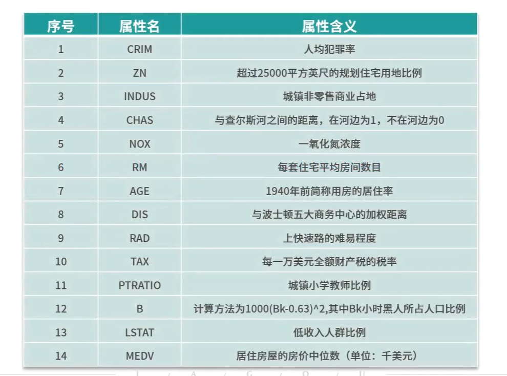

### 我们也可以在网上下载一个叫做BostonHousing.csv的文件，比较方便

## 1.新建一个项目，起名数据挖掘实战3-用线性回归预测房价.ipynb，使用BostonHousing.csv文件

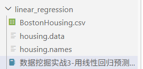

## 2.我们把前13个列作为特征值，最后一个列作为目标值

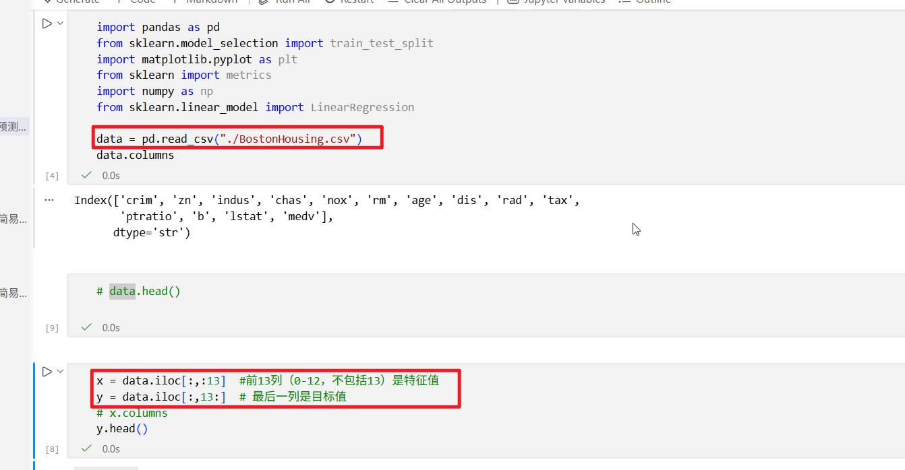

## 3.查看一下数据的规模

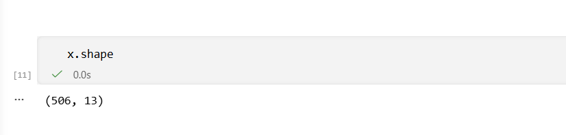

## 4.然后查看一下数据的前5行

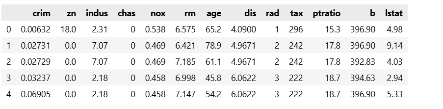

## 5.再用x.info()来查看数据的描述，发现数据没有缺失值

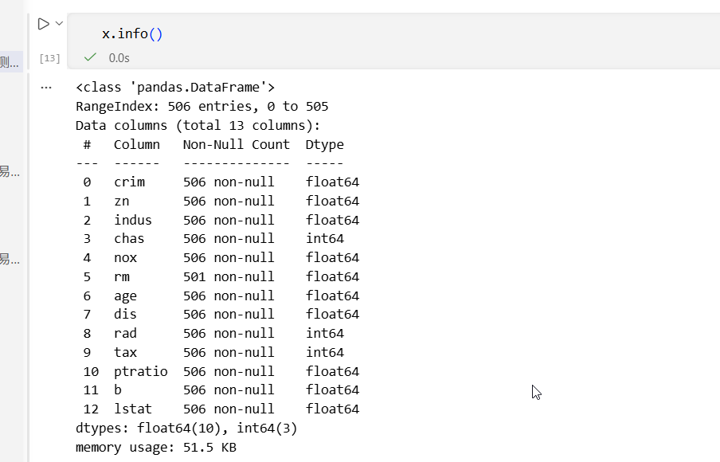

## 6.查看数据的均值和最大最小值等等信息x.describe()

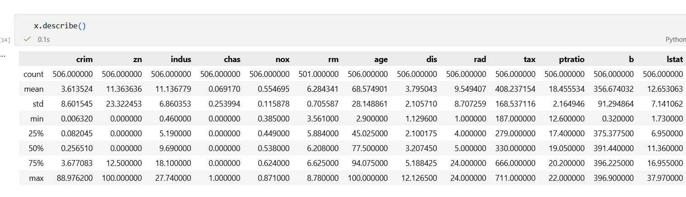

## 7.我们发现rm一列由空值，我们使用中位数来填充，填充后就没有空值了

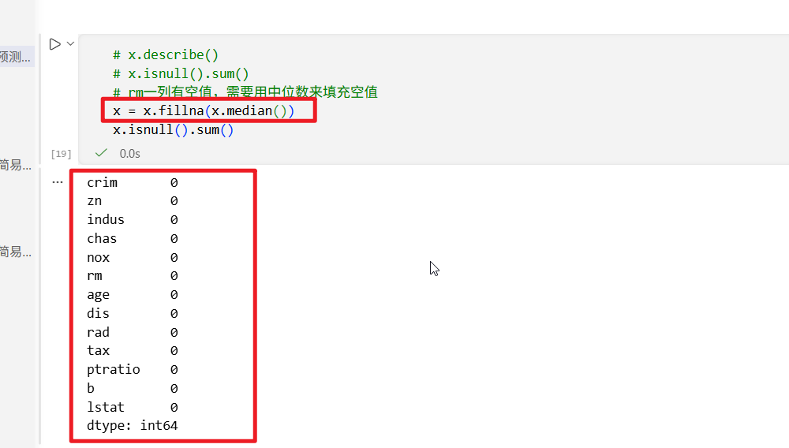

## 8.划分数据集

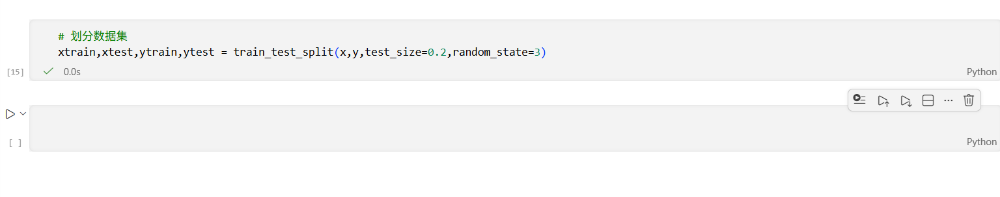

## 9.创建模型和训练模型

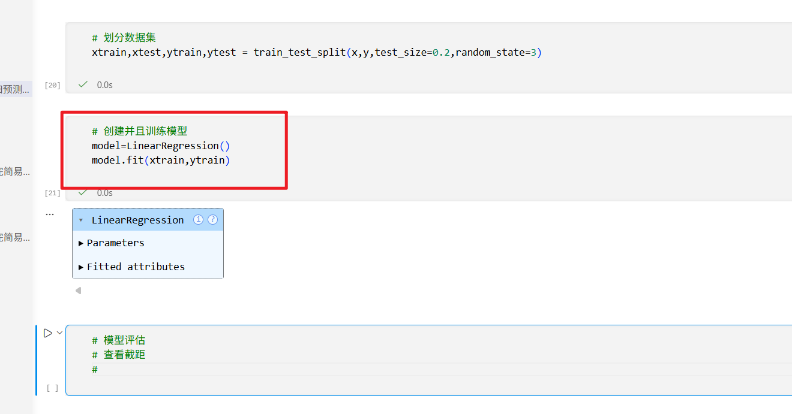

## 10.查看模型的截距和斜率

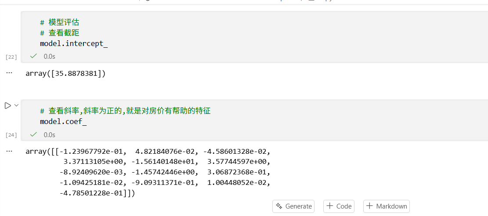

## 11.模型评估，这里利用DataFrame把真实值和预测值放在一起，方便比较，但是显示不完全。我们其实可以把它保存起来

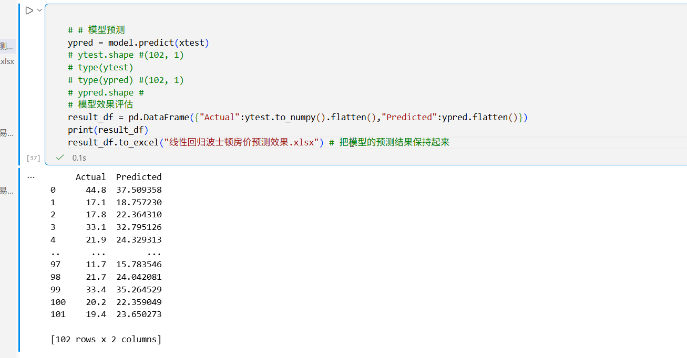

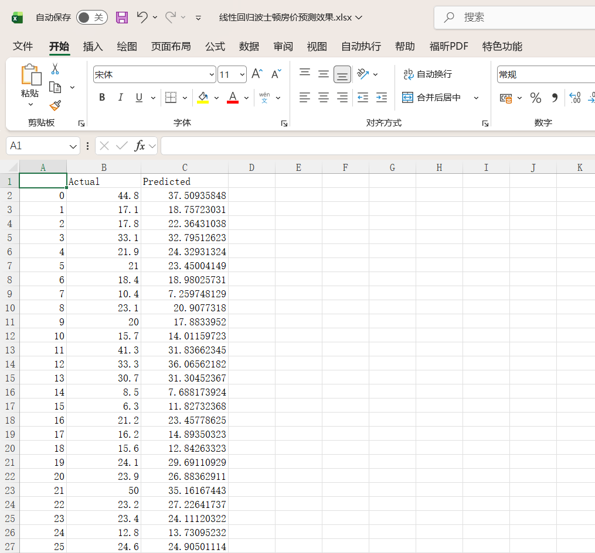

## 12.还可以把结果可视化

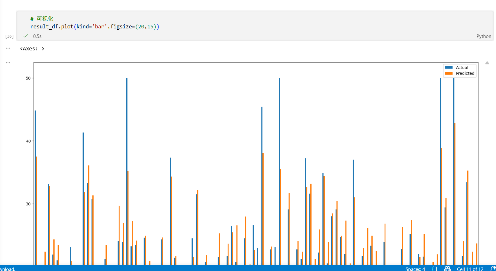

## 13.效果评估，使用这些公式中的一个

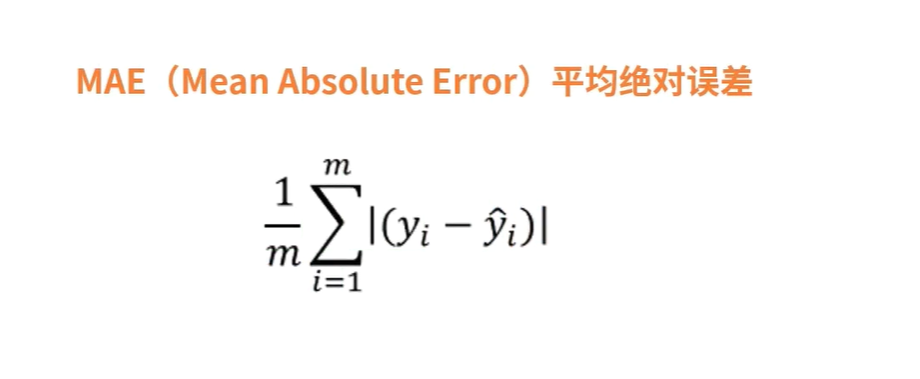

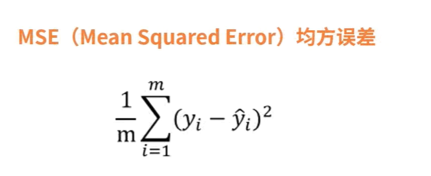

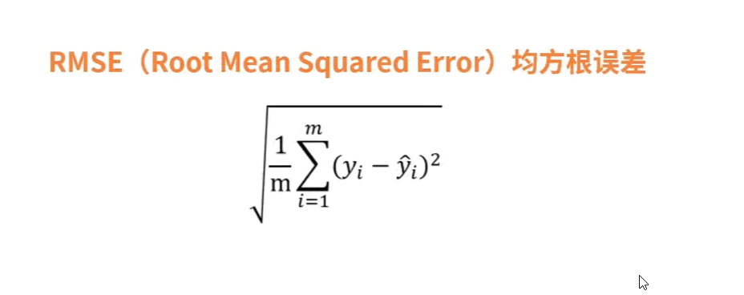

# 总结

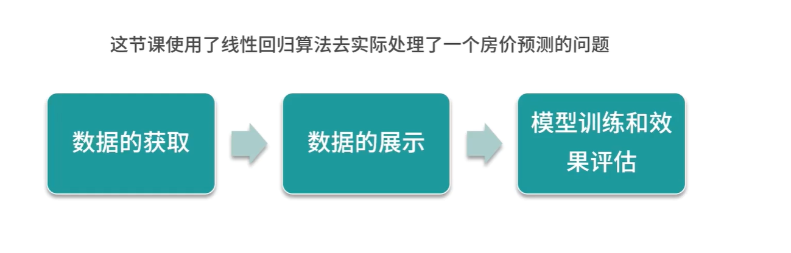