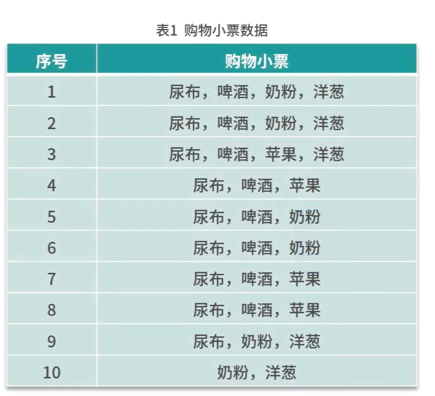
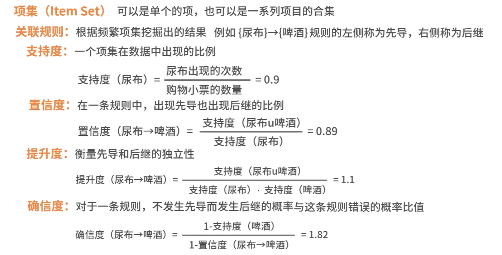
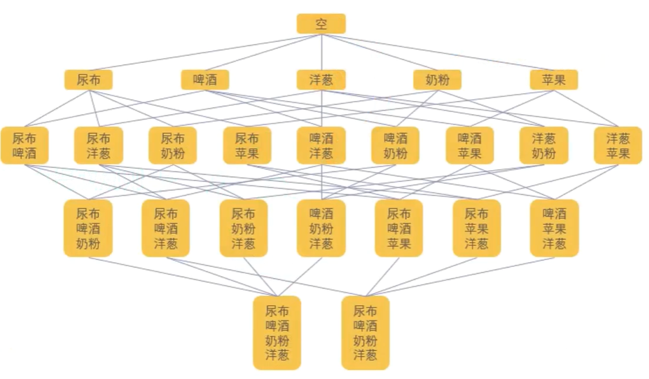
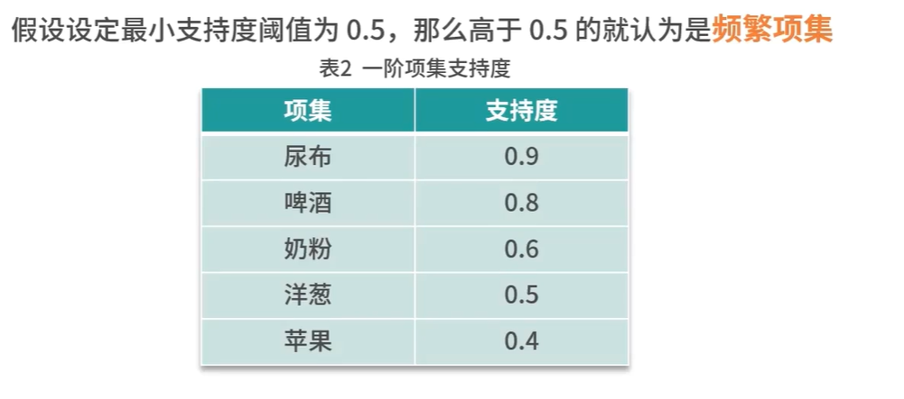
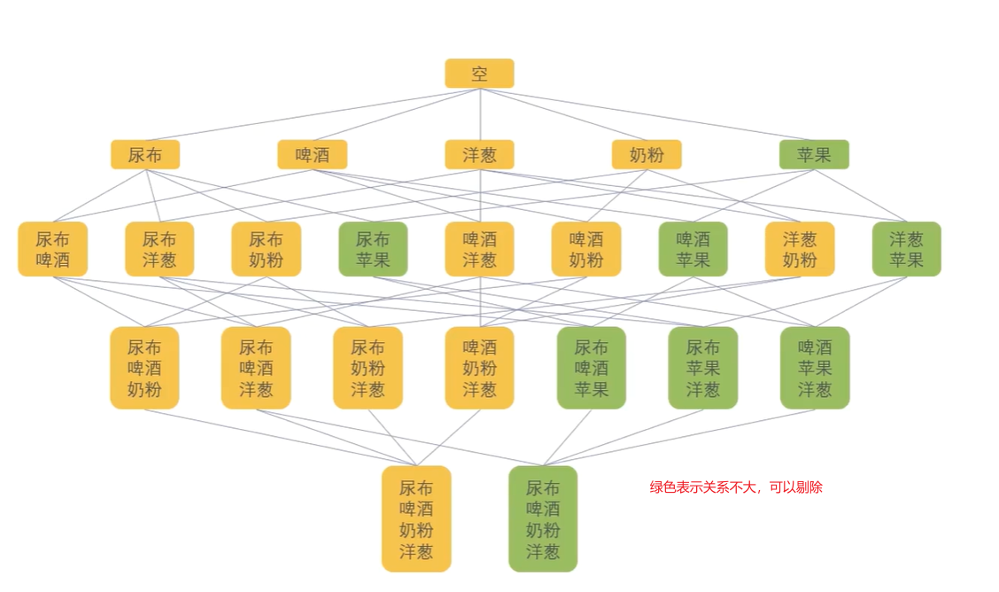
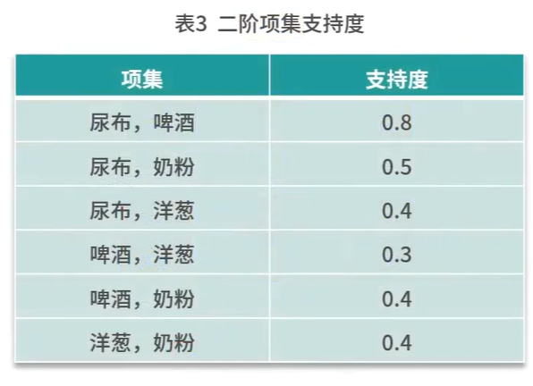
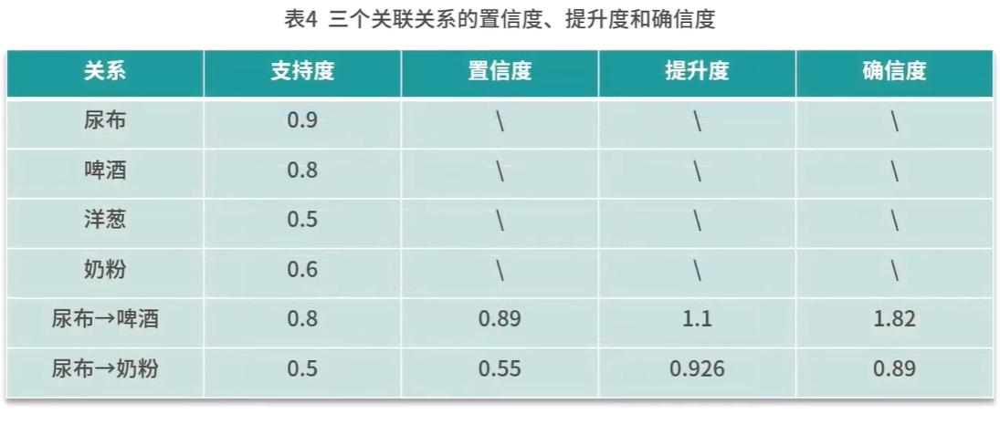
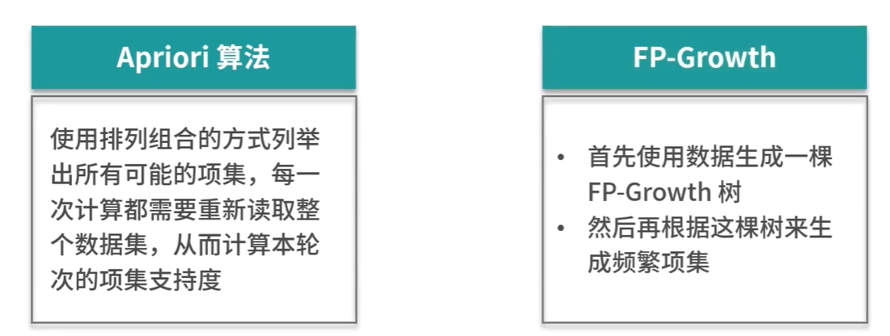
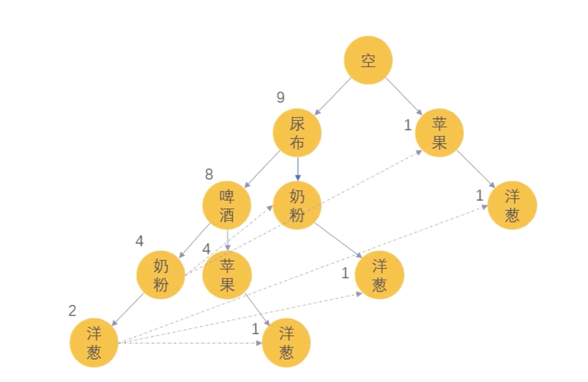
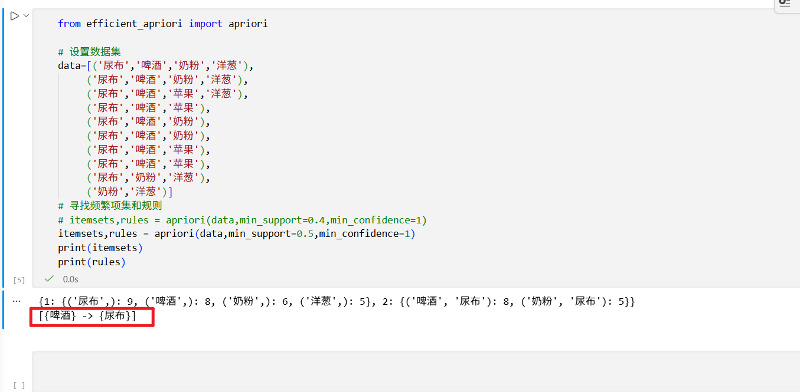

# 这一节课我们来学习关联分析

## 关联分析是一种无监督学习，目标是在大数据中找到的经常一起出现的东西

## 一个例子


## 算法原理

### 一些超市小票数据如下



### 在理解算法原理之前，需要先理解一些概念




### 算法步骤

*1>找出频繁项集*
*2>从频繁项集中提取规则*

## 第一个关联分析算法是Apriori


### 把上面的超市小票可以绘制为下面的关系图



### 然后，我们找出频繁项集



#### 我们发现，苹果的支持度校园0.5，它不是频繁项集，我们就可以把和苹果相关的项标记为绿色，表示可以剔除的




### 接下来，我们进行二阶项集支持度分析



#### 我们发现，后面四个的支持度又不达标，可以剔除，然后就剩下2项，然后我们尝试做3阶支持度，发现已经没有继续下去的必要了，最后我们得到一个这样子的表格



## 第二个算法是FP-Growth算法

### 它和Apriori算法的比较如下




### 构建FP-Growth树，上面的小票数据生成下面的树



### 算法步骤

### 1.寻找频繁项集


### 2.计算关联（这一步和Apriori是一样的）

## Apriori项目演练，需要先安装Apriori包

```
pip install efficient-apriori
```

#### 代码量比较小

```
from efficient_apriori import apriori

# 设置数据集
data=[('尿布','啤酒','奶粉','洋葱'),
     ('尿布','啤酒','奶粉','洋葱'),
     ('尿布','啤酒','苹果','洋葱'),
     ('尿布','啤酒','苹果'),
     ('尿布','啤酒','奶粉'),
     ('尿布','啤酒','奶粉'),
     ('尿布','啤酒','苹果'),
     ('尿布','啤酒','苹果'),
     ('尿布','奶粉','洋葱'),
     ('奶粉','洋葱')]
# 寻找频繁项集和规则
itemsets,rules = apriori(data,min_support=0.4,min_confidence=1)
# itemsets,rules = apriori(data,min_support=0.5,min_confidence=1)
print(itemsets)
print(rules)
```

#### 把支持度的阈值设置为0.4，就会有7条规则

{1: {('尿布',): 9, ('啤酒',): 8, ('奶粉',): 6, ('洋葱',): 5, ('苹果',): 4}, 2: {('啤酒', '奶粉'): 4, ('啤酒', '尿布'): 8, ('啤酒', '苹果'): 4, ('奶粉', '尿布'): 5, ('奶粉', '洋葱'): 4, ('尿布', '洋葱'): 4, ('尿布', '苹果'): 4}, 3: {('啤酒', '奶粉', '尿布'): 4, ('啤酒', '尿布', '苹果'): 4}} [{啤酒} -> {尿布}, {苹果} -> {啤酒}, {苹果} -> {尿布}, {啤酒, 奶粉} -> {尿布}, {尿布, 苹果} -> {啤酒}, {啤酒, 苹果} -> {尿布}, {苹果} -> {啤酒, 尿布}]

#### 把支持度的阈值设置为0.5，就只有1条规则




## FP-Growth项目演练，需要安装mlextend

```
pip install mlxtend
```

##### fp-growth-demo.ipynb

```
import pandas as pd
from mlxtend.frequent_patterns import association_rules,fpgrowth

#  1. 准备原始交易数据
dataset = [
     ('尿布','啤酒','奶粉','洋葱'),
     ('尿布','啤酒','奶粉','洋葱'),
     ('尿布','啤酒','苹果','洋葱'),
     ('尿布','啤酒','苹果'),
     ('尿布','啤酒','奶粉'),
     ('尿布','啤酒','奶粉'),
     ('尿布','啤酒','苹果'),
     ('尿布','啤酒','苹果'),
     ('尿布','奶粉','洋葱'),
     ('奶粉','洋葱')
]

# 2. 将数据转换为独热编码（One-Hot）格式
from mlxtend.preprocessing import TransactionEncoder

te = TransactionEncoder()
te_arr = te.fit(dataset).transform(dataset)
df = pd.DataFrame(te_arr,columns=te.columns_)
# 3. 使用 FP-Growth 算法找出频繁项集（设置最小支持度为 0.5）
feq_itemsets = fpgrowth(df,min_support=0.5,use_colnames=True)
print('频繁项集：')
print(feq_itemsets)
```


频繁项集：
   support             itemsets
0      0.9      frozenset({尿布})
1      0.8      frozenset({啤酒})
2      0.6      frozenset({奶粉})
3      0.5      frozenset({洋葱})
4      0.8  frozenset({啤酒, 尿布})
5      0.5  frozenset({奶粉, 尿布})

```
# 4. 根据频繁项集挖掘关联规则（设置最小置信度为 0.7）
rules = association_rules(
    feq_itemsets,metric='confidence',min_threshold=0.7
)

print('\n关联规则：')
print(rules[['antecedents', 'consequents', 'support', 'confidence']])
```
关联规则：
       antecedents      consequents  support  confidence
0  frozenset({啤酒})  frozenset({尿布})      0.8    1.000000
1  frozenset({尿布})  frozenset({啤酒})      0.8    0.888889
2  frozenset({奶粉})  frozenset({尿布})      0.5    0.833333
```


