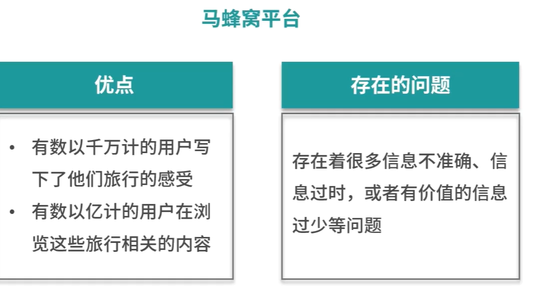
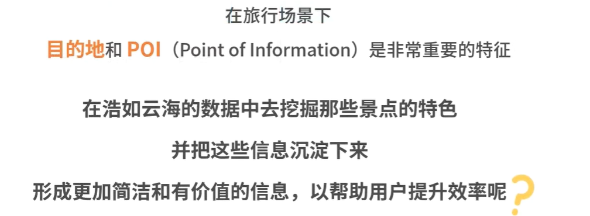
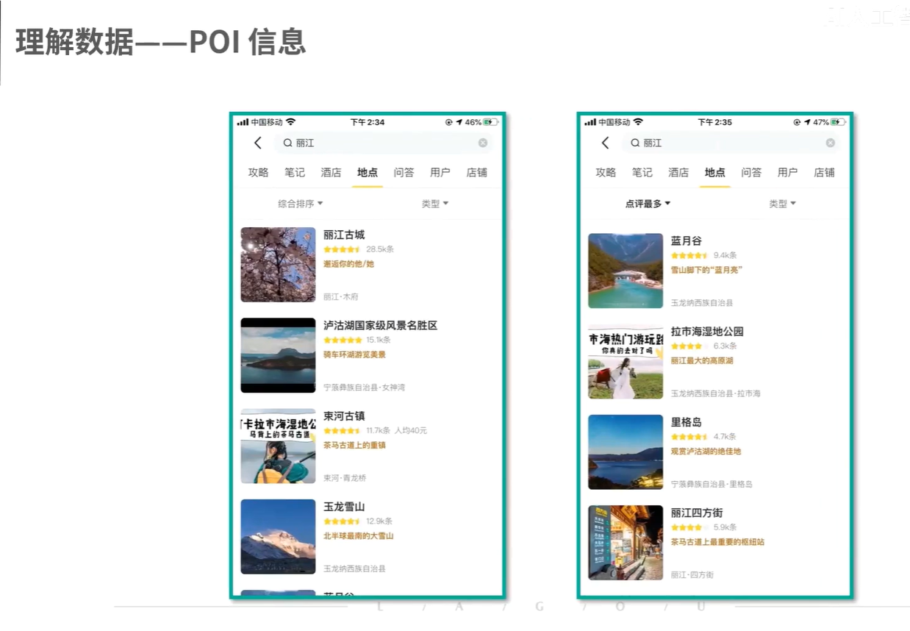
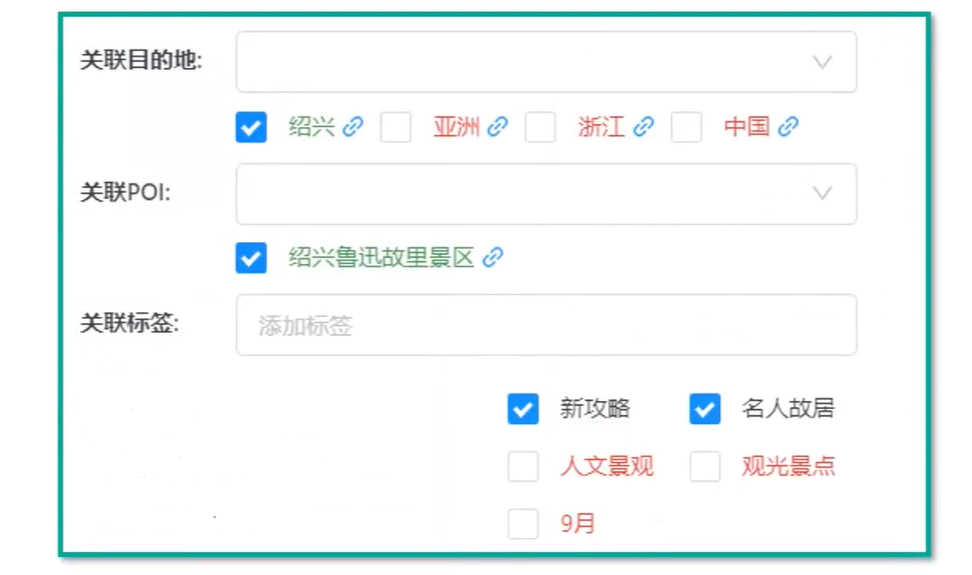
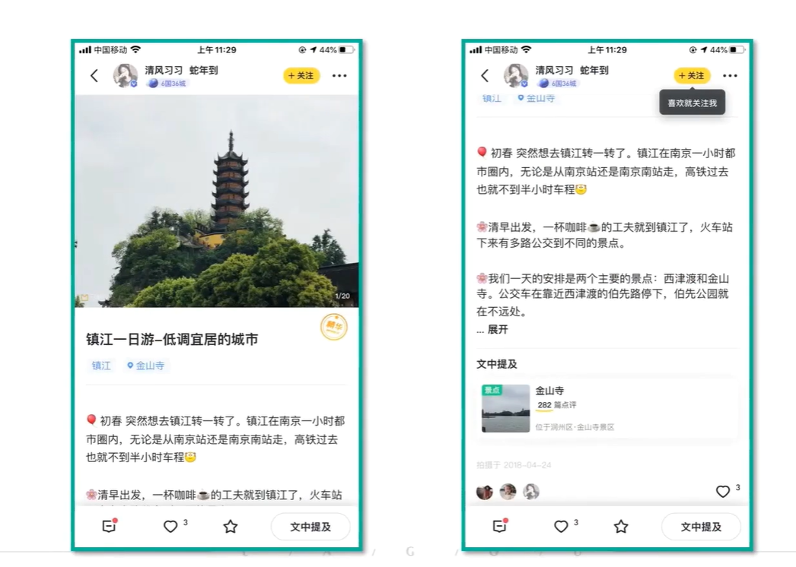
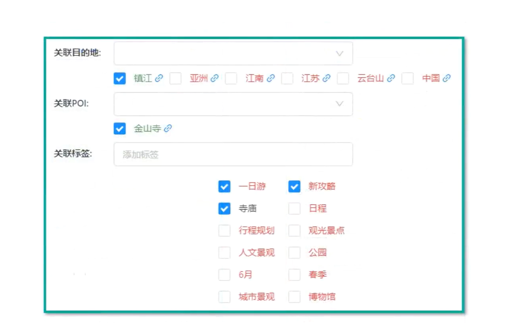
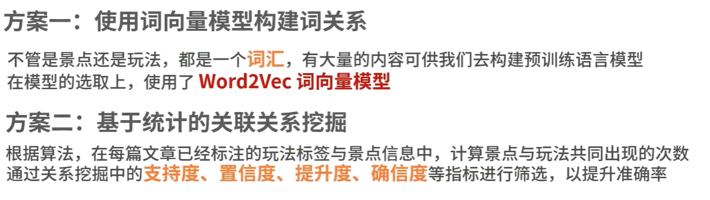
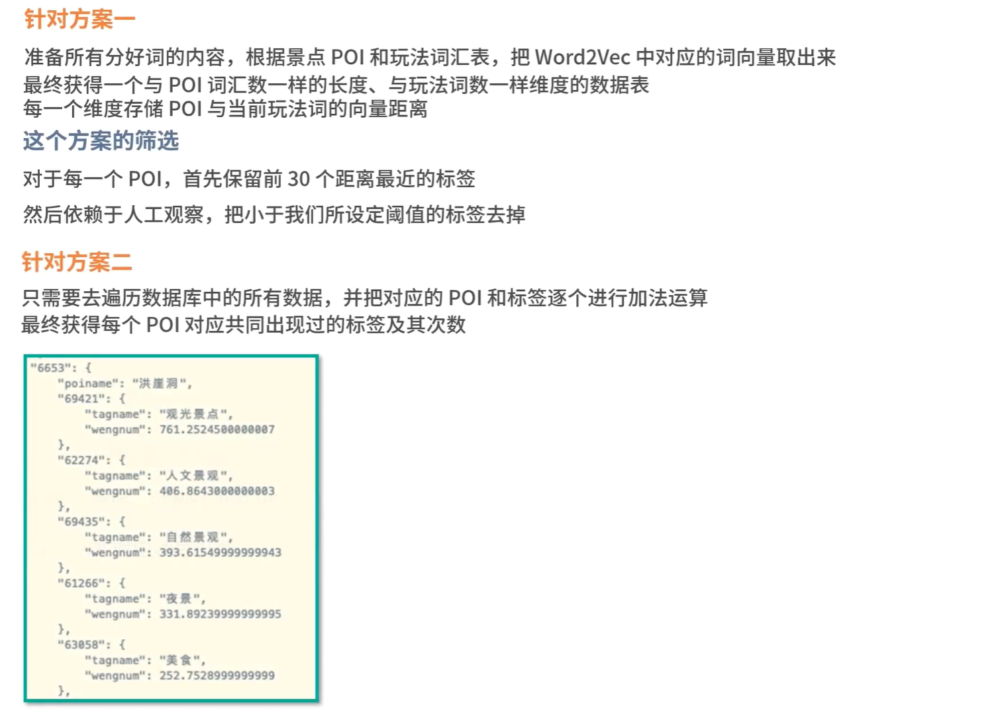
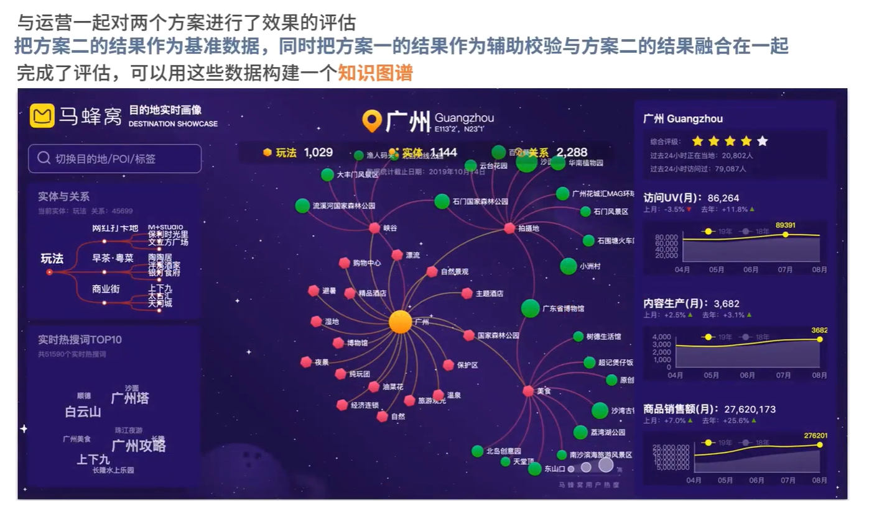
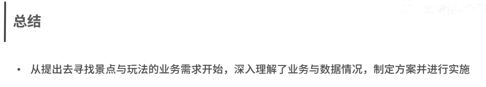

# 0.相关库

## 可能使用到mlxtend库： pip install mlxtend

***\*mlxtend\****（Machine Learning Extensions）是一个开源的 **[Python 第三方库](https://rasbt.github.io/mlxtend/)**，主要作为 **[Scikit-learn](https://scikit-learn.org/)** 的补充和扩展。它集成了许多在日常数据科学、机器学习建模和数据分析中非常实用但 Scikit-learn 未直接提供的辅助工具与算法

更多，参考这里： https://zhuanlan.zhihu.com/p/692863235

# 1.理解业务

# 2.理解数据

## 1》.POI信息

## 2》内容文本标签与POI

# 3.可行方案

# 4.准备数据和模型训练

# 5.评估与应用

