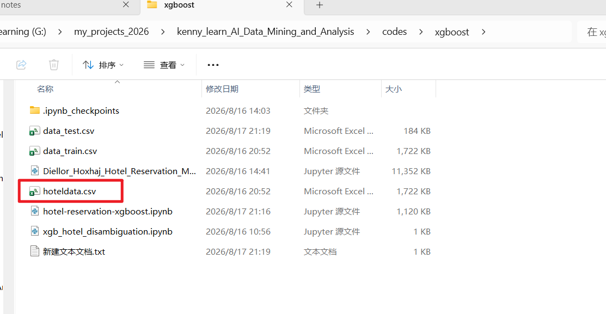
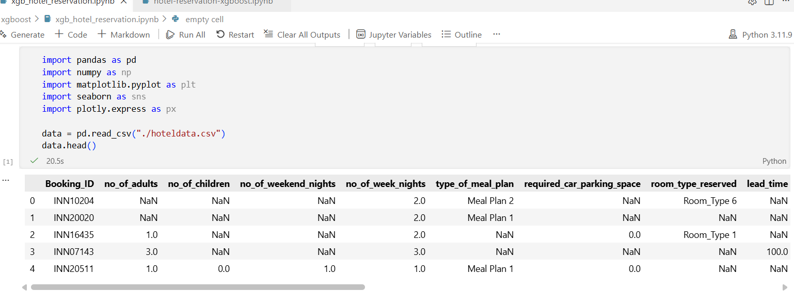
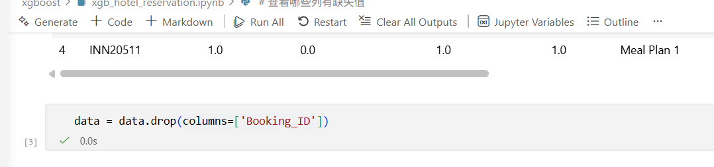
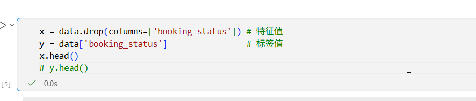
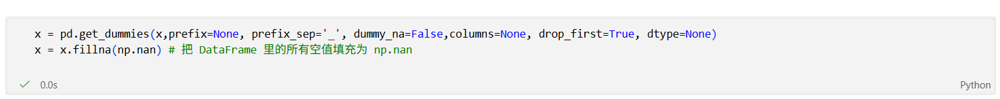
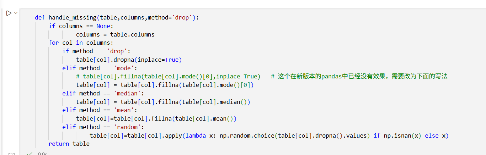
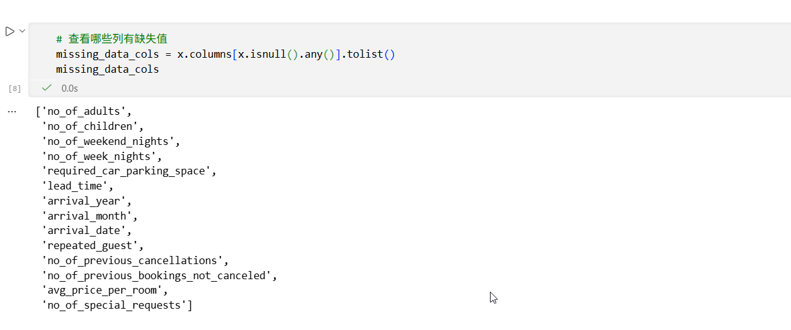
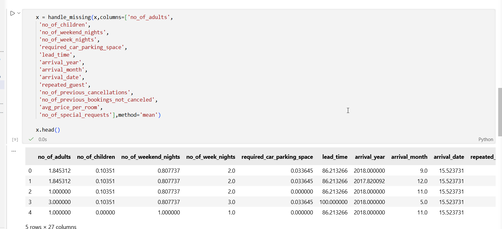
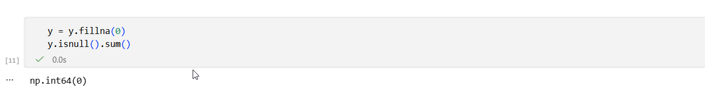
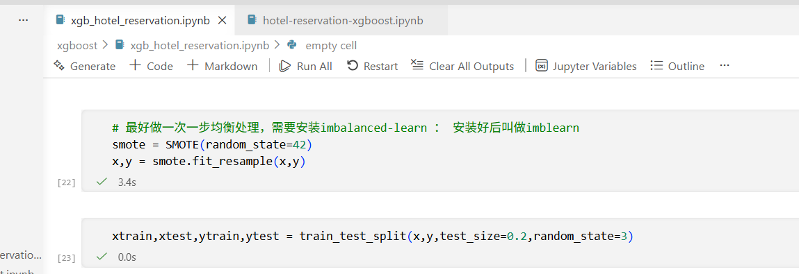

# 课程的xgb酒店满足消岐案例由于没有数据文件，显得很不实用。我们来学习一个网上的预测酒店算法退订的案例

数据下载：https://github.com/diellor/machine-learning/tree/main/hotel-reservation-xgboost

## 下载后发现它有2个数据文件，而且两个文件的列不一样，其实我们只需要data_train.csv. 我们把它复制一份改名hoteldata.csv


##  1.为了方便学习，我们可以给vscode安装jupyter插件，设置python内核，就可以用vscode来开发jupyter项目了，我们打开vscode创建一个xgb_hotel_reservation.ipynb文件,导入需要的库，然后加载数据，接着我们进行后面的步骤



## 2.Booking_ID是不需要的，我们需要把它删除



## 3.确定特征值x和标签值y，也就是features和target




## 4.把字符串的值进行编码处理标签把所有的空值都转化为np.nan



## 5.创建一个通用的处理空值的还是handle_missing




## 6.查看我们的数据里面哪些列有空值




## 7.然后就给特征值填充空值



## 8.给标签值也填充空值



## 9.数据集划分



## 10.模型训练和评估，这里使用网格搜索来寻找最佳参数

```
#模型训练和评估
# 1.创建管线
from sklearn.model_selection import GridSearchCV


# pipe = Pipeline([('clf',xgb.XGBClassifier(use_label_encoder=False))])
pipe = Pipeline([('clf',xgb.XGBClassifier(use_label_encoder=True))])

# 2.配置参数
params={
 "clf__learning_rate"    : [0.05, 0.10, 0.15, 0.20, 0.25, 0.30 ],
 "clf__max_depth"        : [ 3, 4, 5, 6, 8, 10, 12, 15],
 "clf__min_child_weight" : [ 1, 3, 5, 7 ],
 "clf__gamma"            : [ 0.0, 0.1, 0.2 , 0.3, 0.4 ],
 "clf__colsample_bytree" : [ 0.3, 0.4, 0.5 , 0.7 ],
 "clf__subsample"        : [0.6, 0.7, 0.8, 0.9, 1.0],
 "clf__reg_alpha"        : [0, 0.001, 0.005, 0.01, 0.05],
 "clf__reg_lambda"       : [0.01, 0.1, 1.0, 10.0, 100.0]
}
# 3.创建GridSearchCV对象
cv = RandomizedSearchCV(pipe,params,cv=5,scoring='accuracy')
# 4.训练
cv.fit(xtrain,ytrain)
# 5.模型预测
ypred = cv.predict(xtest)
# 6.模型评估
print("Accuracy: {}".format(cv.score(xtest, ytest)))
print("Tuned Model Parameters: {}".format(cv.best_params_))
```

### 注意，上面的GridSearchCV对象不要使用GridSearchCV，会很慢很慢。

### 结果如下

```
Accuracy: 0.8260083606372162
Tuned Model Parameters: {'clf__subsample': 1.0, 'clf__reg_lambda': 1.0, 'clf__reg_alpha': 0.001, 'clf__min_child_weight': 1, 'clf__max_depth': 15, 'clf__learning_rate': 0.05, 'clf__gamma': 0.2, 'clf__colsample_bytree': 0.3}
```

### 准确率有0.826，还是可以的


